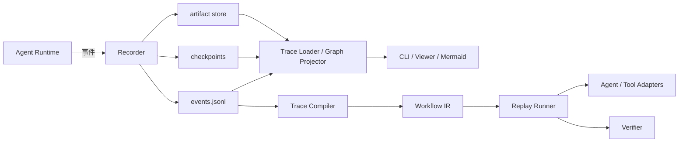

# Agent Loop Snapshot

Agent Loop Snapshot 是一个面向 Agent Runtime 的运行记录、可视化与回放工具。它把一次 Agent Loop 中的模型调用、工具调用、状态变化、检查点和产物保存为可移植快照，并可进一步生成流程图或编译为可执行工作流，让另一个 Agent 在明确的权限和验证规则下复现任务。

> 当前状态：Snapshot 协议 v0.2、通用函数包装、OpenAI/Anthropic SDK 自动采集、OTLP JSON 离线导入、Recorder、查看、图投影与回放门禁均已实现。OTLP 导入快照是 observation-only；外部 OTLP 导出仍在后续 EXP 阶段，尚无默认云端目的地或发送配置。

## 项目目标

- 记录一次 Agent 运行中“发生了什么”，并保留事件之间的因果关系。
- 从快照生成时间线、调用图和状态变化视图。
- 从任意安全检查点继续运行或调试。
- 支持 Mock、Verified 和 Semantic 三种回放方式。
- 将历史 Trace 提炼为与具体 Agent 框架解耦的 Workflow IR。
- 对敏感数据和有副作用的工具调用提供默认安全保护。

本项目不尝试保证大模型输出的逐字确定性，也不记录或依赖模型的隐藏思维链。快照只保存可审计的输入、输出、工具结果、状态变化和简短决策摘要。

## 核心概念

- **Trace**：某次运行实际产生的追加式事件记录，适合审计和分析。
- **Checkpoint**：可用于恢复执行的显式状态快照。
- **Artifact**：文件、图片或大型工具输出，以内容哈希寻址。
- **Graph Projection**：从事件因果关系生成流程图、时间线或调用树。
- **Workflow IR**：从 Trace 提炼出的可参数化执行流程。
- **Replay**：使用记录结果、重新调用工具，或交给另一个 Agent 语义复现。

## Snapshot Schema v0.2

`packages/schema/schemas/` 提供 JSON Schema 2020-12 定义，覆盖 `manifest.json`、`events.jsonl` 中的事件包络、checkpoint 和 artifact reference。新快照使用 `schema_version: "0.2.0"`；读取器继续兼容既有 `0.1.0` 快照。

Workflow IR 使用同一版本线，但它是独立的 `agent-workflow` 文档，而非 Run Snapshot 的一部分。`workflow.schema.json` 与 `validateWorkflow()` 定义了输入、节点、依赖、条件、重试、输出、验证器和权限元数据；JSON 与 YAML 都应先解析为普通对象，再由同一校验器验证。完整格式见 [Workflow IR v0.1](docs/workflow-ir-v0.1.md)。

`@agent-loop-snapshot/replay` 的 `compileTraceToWorkflow(trace)` 会从有效 Trace 提炼可编辑的 Workflow IR、每个节点的 source event 映射，以及候选参数、环境常量和被重试归并的失败步骤报告。它不会复制历史输入值、工具参数、审批记录或决策文本；这些内容需要在人工确认阶段重新提供。

`SemanticReplayRunner` 将有效 Workflow IR、新输入与节点上下文交给显式配置的 Semantic Agent adapter；它允许 adapter 使用与原 Trace 不同的内部工具序列。每次 Agent 或自定义 verifier 调用均经过 Policy Engine，节点的 output schema 或 verifier 不通过时仅在节点 `retry.max_attempts` 范围内重试。结果同时报告 IR 过程是否按原节点顺序一次完成，以及新运行是否满足所有成功条件和输出 schema。

`@agent-loop-snapshot/schema` 的 `inspectSnapshotCompatibility()`、`migrateSnapshot()` 与 `migrateSnapshotDirectory()` 提供版本兼容性检查和显式迁移。当前支持 `0.0.0` 到 `0.1.0`；迁移始终生成新文档或新目录，未知 major 版本只能安全查看元数据，不能执行或自动迁移。

Semantic Agent adapter 可选择声明 `semantic.node.*` 能力；`inspectSemanticAgentCompatibility()` 会在运行前比较 Workflow IR 所需的节点能力。仓库提供 `ScriptedSemanticRuntimeAdapter` 作为独立的确定性第二 runtime，用于兼容性和降级测试；未声明细粒度能力的旧 adapter 保持“支持全部节点”的兼容模式。

事件的 `sequence` 只表示单次 Run 的写入顺序，`parent_ids` 表示因果关系，因此可以表达并行、重试和多父节点汇合。未知字段可被读取器忽略；未知事件类型作为 opaque event 保留，但不能被回放执行。大 payload 可以由内容寻址的 artifact reference 替代。

Schema 包导出 `validateSnapshot()` 和 `validateSnapshotDirectory()`。验证失败时会返回带 JSON Pointer 路径、错误码和严重级别的诊断；目录验证还会检查 artifact 的 SHA-256 和字节数。

Recorder 包提供 `startRun`、`appendEvent`、`checkpoint`、`completeRun` 和 `failRun`。事件通过显式 `EventContext` 传递父节点；同一 Run 的并发追加会被串行提交，并保留并行分支的共同父节点和汇合节点。

`JsonlEventWriter` 支持逐事件、批量或手动 flush，并在关闭时同步刷盘。`SnapshotWriter` 将运行中的 manifest 写入临时文件，终止时通过原子重命名提交；`inspectSnapshotDirectory()` 会识别临时 manifest、未完成 Run 和 JSONL 尾部损坏。

`ArtifactStore.open(<snapshot>/artifacts)` 将字符串、二进制和未知媒体类型的内容按 SHA-256 写入 `artifacts/sha256-<digest>`，通过临时文件和原子重命名避免半成品；并发写入会去重，`verify()`、`get()` 和 `verifyReferences()` 会报告缺失、篡改或字节数不匹配，而不会尝试解码媒体类型。

`CheckpointStore.open(<snapshot>/checkpoints)` 将全量可恢复状态按最后事件的 `sequence` 写入 `checkpoints/<sequence>.json`，使用临时文件和原子重命名提交。`SnapshotWriter.asInterceptor()` 会在 Recorder 创建 checkpoint 后自动持久化；`reconstructState()` 优先从最近且哈希有效的 checkpoint 应用后续 `state.changed` 事件，checkpoint 缺失、损坏或哈希不一致时会降级为从事件流重建。可恢复状态边界只包含显式 `state.changed` 的 set、merge、append 和 delete 操作，模型调用、工具结果和决策摘要属于观察状态。

`RedactionPipeline` 支持 JSON Pointer 字段规则、数组通配符、正则规则和自定义 redactor。通过 `asInterceptor()` 接入 Recorder 时，脱敏在 JSONL 持久化前执行，并只在 `security.redactions` 中记录类别、路径和策略。`createDefaultRedactionPipeline()` 覆盖常见 API key、Bearer authorization 和敏感字段；JSON 或文本 artifact 应在 `ArtifactStore.put()` 前通过 `redactArtifact()` 处理，二进制内容不会被猜测解码。

`Trace` 包的 `loadTraceSnapshot()` 流式读取 `events.jsonl`，加载 manifest、checkpoint 和 artifact metadata，并建立 event、children、actor 和 type 索引。Artifact metadata 的 `path` 始终是以 `/` 分隔的快照相对路径，因而不会泄露加载机器目录；内容通过 `readArtifact()` 按需读取。查询模型支持按事件 ID、父子关系、actor、类型、sequence 和时间范围检索；加载器会返回 schema、JSONL、因果关系和 artifact 完整性诊断，未知事件类型仍作为 opaque event 保留。

需要在加载后决定执行资格时，调用 `@agent-loop-snapshot/replay` 的 `assessTraceExecution(trace)`；它直接复用已加载的 `TraceSnapshot`，无需再次读取快照目录。结果只是证据资格判断，仍不授予执行权限。

`Graph` 包提供因果 DAG、调用树和线性时间线投影。DAG 保留并行分支和多父节点汇合；投影支持 actor、事件类型、状态和 sequence 范围过滤，并默认折叠连续模型流式事件和低层噪声，同时保留每个图节点对应的源 event ID。

`CLI` 包提供 `alsnap validate`、`alsnap inspect`、`alsnap graph`、`alsnap replay` 和 `alsnap import-otel`。`validate` 检查快照并输出诊断，`inspect` 输出不包含 payload 的运行摘要，`graph` 默认导出 Mermaid DAG，也支持调用树、时间线和 JSON。退出码为 `0`（成功）、`2`（快照校验失败或无有效导入 trace）和 `1`（参数或运行错误）；所有命令支持 `--json` 机器可读输出。

## 总体架构



## 建议的快照布局

```text
run-snapshot/
├── manifest.json
├── events.jsonl
├── workflow.yaml
├── checkpoints/
│   └── 000001.json
└── artifacts/
    └── sha256-<digest>
```

`events.jsonl` 是事实记录，`workflow.yaml` 是从事实记录提炼出的可执行流程。两者需要分离：历史运行可能包含失败尝试和环境偶然性，不应默认被另一个 Agent 原样照搬。

## 回放模式

| 模式            | 行为                                                        | 主要用途             |
| --------------- | ----------------------------------------------------------- | -------------------- |
| Mock Replay     | 返回快照中保存的模型和工具结果，不重新产生副作用            | 调试控制流、复现 UI  |
| Verified Replay | 重新执行调用，并将结果和快照或断言比较                      | 回归测试、兼容性测试 |
| Semantic Replay | 另一个 Agent 根据目标、约束、输出协议和成功条件重新完成任务 | 跨模型、跨框架复用   |

任何外部写入或破坏性操作在回放时都必须经过策略检查；快照中的历史授权不能自动成为新运行的授权。

## 技术路线

项目已确定使用 TypeScript 和 Node.js 当前活跃 LTS 版本实现首个 SDK、核心包、CLI 与 Viewer，并使用 JSON Schema 定义语言无关的持久化协议。建议的模块边界为：

首个目标 Runtime 是仓库内维护的框架无关 TypeScript 示例 Runtime。它用于稳定验证 Recorder 和快照协议，支持模型/工具 adapter、并行只读调用、失败重试和显式状态变更，不要求绑定具体模型供应商。当前运行时与存储边界见 [ADR-0002](docs/adr/0002-runtime-and-storage.md)，事件身份、顺序、时钟与错误模型见 [ADR-0003](docs/adr/0003-event-ordering-and-identity.md)。

```text
packages/
├── schema/       # 事件、清单和 Workflow IR schema
├── recorder/     # 事件写入、检查点、artifact store
├── trace/        # 加载、查询、状态重建
├── graph/        # DAG、时间线和 Mermaid 投影
├── replay/       # 三种回放执行器及安全策略
├── instrumentation/ # 通用异步函数包装与运行上下文
├── instrumentation-openai/ # OpenAI SDK 自动采集
├── instrumentation-anthropic/ # Anthropic SDK 自动采集
├── otel-import/  # OTLP/HTTP JSON 解析与观察快照映射
├── cli/          # validate、inspect、graph、replay
└── example-runtime/ # 框架无关的模型/工具 adapter 示例 Runtime
apps/
└── viewer/       # 可选的交互式查看器
```

`examples/example-agent/.env.example` 提供了模型环境配置模板。复制为本地 `.env` 后填写 `ALS_MODEL_API_KEY` 和 `ALS_MODEL_NAME`，再运行 `packages/example-runtime` 的 CLI；`.env` 已被 git 忽略。

当前 workspace 已完成基础协议、快照记录、Trace、Graph 和 CLI。开发环境使用 Node.js 24.20.0 和 pnpm 11.19.0；依赖安装、构建、类型检查、lint、格式检查和测试可以通过以下命令执行：

```bash
pnpm install
pnpm run check
pnpm run benchmark:trace
pnpm run benchmark:als-502
```

CI 使用同一套 `pnpm run check` 质量门禁。`pnpm run benchmark:trace` 用于复测 100k Trace Loader 基线；核心包、Example Runtime 和 Mock Replay CLI 均已提供可构建入口。

TypeScript 技术决策记录在 [ADR-0001](docs/adr/0001-use-typescript.md)。未来可以依据相同 JSON Schema 增加 Python SDK，但不会为此复制或分叉快照协议。

## CLI

## SDK 自动采集（CAP-05）

`@agent-loop-snapshot/instrumentation-openai` 与
`@agent-loop-snapshot/instrumentation-anthropic` 是可选的 Node.js ESM 包。当前
固定支持 Node.js 24、OpenAI `7.15.0` 和 Anthropic `0.125.0`：分别覆盖 OpenAI
Chat Completions、Responses，以及 Anthropic Messages 的 `create()` 非流式与
`stream: true` 调用。未在此范围内的 SDK 版本、各 SDK 的 `.stream()` helper、
Azure/Bedrock/Vertex 专用客户端均不在当前支持矩阵内。

初始化必须早于业务模块加载。包装直接保留 SDK 返回的 Promise-like 对象及其
`.withResponse()` / `.asResponse()` 等辅助能力；流仅在业务代码迭代时观测，不会
提前读取、缓冲或发起第二次请求。默认记录内容副本并在落盘前脱敏；传入
`recording: 'metadata-only'` 时不记录模型 prompt 或完整响应正文。

```ts
import { initInstrumentation } from '@agent-loop-snapshot/instrumentation';
import { openAIIntegration } from '@agent-loop-snapshot/instrumentation-openai';
import { anthropicIntegration } from '@agent-loop-snapshot/instrumentation-anthropic';

const telemetry = initInstrumentation({
  snapshotDir: './runs',
  integrations: [
    openAIIntegration({ recording: 'metadata-only' }),
    anthropicIntegration({ recording: 'metadata-only' }),
  ],
});
const { main } = await import('./app.js');
try {
  await telemetry.run({ input: { goal: '完成任务' } }, () => main());
} finally {
  await telemetry.shutdown();
}
```

自动采集只记录 `telemetry.run()` 的异步上下文中的调用；范围外调用保持原行为，
并产生一次诊断。流未被消费或在 drain deadline 后仍未结束时，快照标记为 partial
且不可执行；提前结束会额外标记 `stream_ended_early`。SDK 内部重试不会被伪造为
独立 attempt。

## 采集与导入入口

| 入口                                      | 适用场景                         | 产生的快照                                                |
| ----------------------------------------- | -------------------------------- | --------------------------------------------------------- |
| `instrument()`                            | 自有 Promise 模型/工具函数       | 原生运行记录；只有最后显式 checkpoint 才含可恢复状态 hash |
| `initInstrumentation()` + SDK integration | 继续使用 OpenAI/Anthropic 原 SDK | SDK 观察记录；不自动记录应用最终状态                      |
| `alsnap import-otel`                      | 已有 OTLP/HTTP JSON trace 文件   | `otel-import` 观察快照；永远不可 replay/resume/compile    |

通用入口要求每个工具显式声明 `sideEffect`，并仅复制、脱敏记录副本；业务参数、返回值、
错误和 `this` 不会被替换。默认模式是 strict：请求记录失败时不执行业务函数，调用后记录
失败会抛记录错误。SDK 自动集成使用 best-effort：记录故障只产生诊断，保留 SDK 的原结果
或原错误。三种入口都不会扫描局部变量、自动保存大对象、或把模型返回值伪装成可恢复状态。

OpenAI `7.15.0` 支持 Chat Completions 与 Responses 的 `create()`；Anthropic `0.125.0`
支持 Messages `create()`。两者先支持非流式，再支持 `stream: true` 的异步迭代。调用方必须
在迭代流时才会被观测；采集器不会预读、缓冲或发起第二个请求。专用 `.stream()` helper、
Azure、Bedrock、Vertex 客户端以及不在固定版本范围内的 SDK 不受支持。

自动集成必须在加载业务模块前初始化。ESM 使用动态 `import()`；CJS 使用 `require()` 放在
初始化之后。已经加载 SDK、经过打包器静态内联、或第三方随后替换方法的场景不保证被捕获；
本项目不重写 Node 模块加载器，也不替换应用的全局 OpenTelemetry provider/context manager。

### 三个离线示例

所有示例均无真实 API key、付费请求或生产 trace。先执行 `pnpm build`，然后可分别运行：

```sh
node examples/function-instrumentation/demo.mjs
node examples/sdk-instrumentation/demo.mjs
pnpm alsnap -- import-otel examples/otel-import/trace.json --output ./runs/otel-import --json
```

也可通过 `pnpm run examples:check` 一次运行三条离线闭环。示例详情位于
[`examples/function-instrumentation`](examples/function-instrumentation/README.md)、
[`examples/sdk-instrumentation`](examples/sdk-instrumentation/README.md) 和
[`examples/otel-import`](examples/otel-import/README.md)。

### OTLP JSON 导入

```sh
pnpm alsnap -- import-otel trace-a.json trace-b.json --output ./imported-runs --json
pnpm alsnap -- inspect ./imported-runs/run_<generated-id> --json
pnpm alsnap -- graph ./imported-runs/run_<generated-id> --kind timeline --format json
```

仅接受 OTLP/HTTP JSON 的 `ExportTraceServiceRequest`（`resourceSpans`）；protobuf、gRPC、
控制台文本及厂商 UI 导出格式不支持。每个常规输入文件上限为 64 MiB，多个文件会在一次导入中
合并并按 source trace 拆为独立目录。导入前会脱敏常见凭据字段与 token 模式，既有目录绝不覆盖。
报告包含源 trace ID、导入/拒绝/去重/截断计数、完整度、限制和诊断。

`otel-import` 快照即使结构有效也只是可查看证据：缺损会标为 `partial`，未发现缺损仅为
`unknown`，绝不因此变为 `complete` 或可执行。`inspect` 和 `graph` 可使用；`replay`、
恢复与 Workflow 编译会拒绝它。OTLP 导入不会发送任何数据到外部平台；外部 OTLP 导出及其
endpoint、鉴权、内容策略配置仍未实现。

基础检查和图导出命令已经可用：

```bash
pnpm run alsnap -- validate ./runs/run-123
pnpm run alsnap -- inspect ./runs/run-123
pnpm run alsnap -- graph ./runs/run-123 --format mermaid
pnpm run alsnap -- graph ./runs/run-123 --kind timeline --format json
pnpm run alsnap -- graph ./runs/run-123 --actor agent.main --type tool.completed
```

Mock Replay 会将记录的模型和工具结果写入一个新的快照；输出目录必须不存在：

```bash
pnpm run alsnap -- replay ./runs/run-123 --mode mock --output ./runs/run-123-mock-replay
```

Verified Replay 需要调用方在 SDK 中显式配置 live adapters 和当前授权；Workflow 命令仍在规划中：

```bash
pnpm run alsnap -- workflow compile ./runs/run-123
pnpm run alsnap -- workflow run ./runs/run-123/workflow.yaml
```

## MVP 完成标准

首个 MVP 应能完成一条闭环：

1. 示例 Agent 通过 SDK 记录模型调用、工具调用和状态变更。
2. 中途中断后仍能读取并验证已有快照。
3. CLI 可以输出摘要和 Mermaid DAG。
4. Mock Replay 可以复现相同的控制流和最终状态。
5. 所有外部写操作在回放中默认阻止，除非调用方重新授权。
6. 固定夹具能够稳定通过 schema、恢复、脱敏和回放测试。

完整的里程碑、任务依赖和逐项验收标准见 [实施规划](docs/implementation-plan.md)。

## 设计原则

- **事件溯源优先**：运行记录只追加，不在原地改写历史事件。
- **因果关系优先**：事件使用稳定 ID 和父事件 ID 表达并行与分支。
- **大对象外置**：大型输入输出进入 artifact store，事件仅保存引用和摘要。
- **安全默认值**：敏感字段默认脱敏，副作用默认不回放。
- **协议可迁移**：所有持久化格式具有版本号和迁移策略。
- **结果可验证**：每个可执行节点都应声明输出 schema 或成功条件。

## 文档

- [实施规划与任务清单](docs/implementation-plan.md)
- [开发交接记录](docs/handoff.md)
- [ALS-502 性能、并发与故障注入](docs/benchmarks/als-502.md)
- [安全与发布指南](docs/security-and-release.md)
- [变更日志](CHANGELOG.md)
- [Workflow IR v0.1](docs/workflow-ir-v0.1.md)
- [Schema compatibility and migration](docs/schema-compatibility.md)
- [ADR-0001：使用 TypeScript 实现首个版本](docs/adr/0001-use-typescript.md)
- [ADR-0002：首个 Agent Runtime 与快照存储边界](docs/adr/0002-runtime-and-storage.md)
- [ADR-0003：事件顺序、身份、时钟与错误模型](docs/adr/0003-event-ordering-and-identity.md)

## 许可证

本项目采用 [MIT License](LICENSE)。

## 参与开发

项目进入编码阶段后，每个任务应关联一个 `ALS-*` 编号，并在合并前满足该任务的验收标准。协议或安全语义发生变化时，需要同时更新 schema、迁移测试和相关文档。
