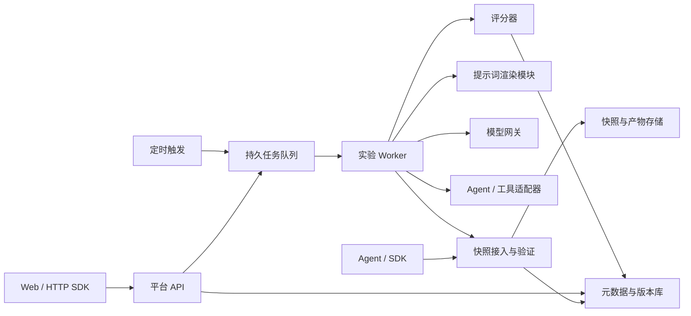

# Agent 实验、评测与运行复用平台开发计划

创建日期：2026-09-12。状态：待实施。本文件描述另一个独立平台项目。本文当前存放位置仅用于交付文档，不是平台的开发目录；平台实施前将本文复制到新平台仓库，不在 Agent Loop Snapshot 项目中创建平台代码。

**强制项目边界：Agent Loop Snapshot 是平台引入的外部依赖。平台具有独立仓库、目录、package.json、锁文件、CI、发布和数据库；不得加入 Snapshot 的 workspace，不修改其源码、包配置或发布配置，不依赖其本地目录结构。本文后续所有 apps/、packages/、docs/ 相对路径均指新平台仓库。**

## 1. 产品目标与实施约定

平台回答四个问题：一次 Agent 运行发生了什么；改变模型、提示词、记忆、RAG 或工具之后是否变好；变化由哪些因素造成；有效流程能否在明确条件下复用。

首个交付闭环：接入一个真实可执行的 Agent → 记录运行 → 从运行建立测试案例 → 固定版本并运行实验 → 客观/人工评分 → 比较结果 → 保存可复用配置。

本计划全部任务初始状态为 TODO。编号使用 AEP，避免与现有 ALS、CAP、EXP 任务混淆。任务卡中的依赖必须先验收；交付物、异常处理和验收条件均属于完成范围。coding agent 每次执行一个任务或一个明确指定的连续任务组，不能以 mock 页面替代真实闭环，也不能把尚未实现的能力标为完成。

### 1.1 当前基线

- 通过 `@agent-loop-snapshot/schema`、`@agent-loop-snapshot/recorder`、`@agent-loop-snapshot/trace`、`@agent-loop-snapshot/graph`、`@agent-loop-snapshot/replay` 的公开 exports 接入协议、存储、图投影和策略守卫；包名是依赖标识，不是平台应创建或访问的源码目录。
- 复用通用函数采集、OpenAI/Anthropic SDK 采集、OTLP 导入/导出；实际支持范围以代码及兼容测试为准。
- 当前 OpenAI-compatible 示例适配器主要处理文本请求，不能当作完整模型网关。
- OTLP 导入是 observation-only，不能因平台导入成功就升级为可恢复、可回放记录。
- Verified Replay 是历史调用验证；Semantic Replay 是 Workflow 约束下的语义执行。两者都不自动等价于完整自由 Agent 评测。
- 当前检查点只能保证显式状态的保存与重建，不代表业务进程、外部环境和任意框架可恢复。
- 尚需新增 Web/API、持久化资产管理、实验 Runner、评分、任务队列和调度。

实现前阅读所选依赖版本随发布提供的公开 API、协议、安全语义和兼容说明，并在平台仓库保存兼容矩阵。以已安装发布制品的公开 exports 和黑盒契约测试核实能力，不要求开发者拥有 Snapshot 源码目录。公开接口缺失时提出上游接口需求或显式标记能力不可用，不读取内部源码来绕过接口。平台实施时保留平台工作区已有改动，不回退无关文件。

### 1.2 首版不做

- 通用 Agent 拖拽开发器、工具市场、自建向量数据库、训练/微调系统。
- 任意 Agent 的零埋点状态恢复或跨框架无损迁移。
- 隐藏思维链采集、逐 token 确定性复现承诺。
- 用一个不透明总分表示所有任务上的模型排名。
- 将外部 Trace、历史审批或模型声明当作可执行授权。

## 2. 总体架构

采用模块化单体 API，加独立 Worker 进程；先不拆微服务。数据库负责元数据、版本、实验和任务状态；对象存储负责快照与大产物；Worker 执行 Agent 和评测。Snapshot 是外部库，通过平台的 snapshot-bridge 模块接入，不依赖平台数据库。

新平台仓库内部目录（不是 Snapshot 项目的扩展目录；仓库名称和绝对路径由创建项目时确定）：

```text
apps/platform-web/          页面与交互
apps/platform-api/          HTTP、鉴权、应用服务入口
apps/platform-worker/       队列消费、实验执行、调度入口
packages/platform-domain/   领域契约、状态机、错误码
packages/platform-store/    数据库迁移、仓储、事务
packages/platform-storage/  本地/对象存储适配
packages/snapshot-bridge/   Snapshot 公开接口封装、版本/能力检查与错误映射
packages/prompt/            模板校验、确定性渲染、渲染清单
packages/model-gateway/     模型协议、OpenRouter、用量及路由记录
packages/agent-adapters/    Agent 启动、停止、恢复与能力协商
packages/experiments/       实验解析、任务编排、比较
packages/evaluations/       规则评分、LLM 评分、人工评分契约
packages/platform-client/   外部 HTTP SDK
```

首选 PostgreSQL 存元数据；首版数据库任务队列与租约即可，不同时引入另一套消息队列。存储接口支持开发环境本地文件和部署环境 S3-compatible 对象存储。Web/API 具体框架在 AEP-001 中锁定，不在实施中反复切换。平台独立管理工具链，运行时必须满足所选 Snapshot 发布版本声明的 engines 与模块格式；新增依赖必须锁版本并有最小构建验证。

### 2.1 平台语言决策：TypeScript

确认采用 TypeScript 开发 Web、API、Worker、提示词模块、实验/评分模块、snapshot-bridge 和首版客户端 SDK；服务端使用 Node.js，模块格式采用 ESM，启用严格类型检查。SQL 用于数据库迁移，不引入第二套主要服务端语言。

理由：平台可以直接消费 TS 依赖的公开类型和异步接口，避免为每次 Trace/Replay 调用维护跨进程桥接；前后端和 SDK 共用领域契约，但外部输入仍需运行时 schema 校验。Snapshot 使用 TS 并不强制所有消费者使用 TS，这里是减少首版集成成本的主动选择。

其他语言 Agent 通过平台 HTTP/SSE、快照文件协议或后续 MCP 接口接入；Python Agent 不需要迁移成 TS。第一版不开发 Python 后端或独立 Python SDK。若未来确需非 Node 后端，可将 snapshot-bridge 部署为独立 Node 服务，但不是本期默认方案。

Node、TypeScript、pnpm 的精确版本在 AEP-001 根据制品 engines、公开兼容说明和干净安装结果固定到平台自己的配置中；不得直接复制上游 workspace 配置，也不自动跟随上游升级。

### 2.2 可移植依赖交付与安装

首版必须支持一个不依赖 Snapshot 源码 checkout 的安装方式；不能假设相关包已经公开发布。当前已检查的部分包声明 private，正式制品的可获取性是 AEP-001 的接入前置条件，而不是已完成事实。

1. **标准通道**：使用上游已发布、可访问的 npm registry（公共或组织私有）制品；平台锁定直接依赖精确版本、传递依赖和完整性信息。
2. **便携通道**：由上游提供包含必要包及其依赖清单的版本化 `.tgz` 集合；放入新平台仓库的 `vendor/agent-loop-snapshot/<release>/` 或下载到同等相对路径；使用相对制品引用与包管理器解析配置安装，所有内部包的传递依赖必须可解析。
3. 制品清单包含包名/版本、SHA-256、依赖集合、协议版本、Node engines、许可及来源。打包产物必须已构建，并将内部 `workspace:` 引用转换成可安装的依赖；不能直接复制开发状态 package.json 充当发布制品。
4. 便携是“不需要上游源码目录或机器固定路径”，不自动等于全离线。若需要离线安装，另提供所有第三方传递依赖的 registry 镜像或可移植缓存，并单独验收。
5. 禁止以指向上游 checkout 的绝对 `file:`/`link:`、`pnpm link`、跨仓库 `workspace:*`、源码软链接、Git submodule 或复制 src 作为正式接入。平台自身 workspace 可以正常使用 `workspace:*`。

依赖制品缺失时可继续平台独立模块和明确标为测试替身的契约开发，但依赖接入任务及对应里程碑必须保持未完成。制品发布、上游新增 export 和上游协议升级交由上游维护流程处理，不纳入平台 coding agent 修改范围。

### 2.3 公开接口与 snapshot-bridge 边界

- 只有 `snapshot-bridge` 直接导入 Snapshot 包的根入口或明确声明的公开子路径；不 deep import `src`、未导出的 `dist` 或其他内部路径。Web 不直接加载 Node 库。
- bridge 提供平台自有的校验、读轨迹、读产物、图投影、记录、执行资格检查、回放和 Workflow 编译/执行接口，内部委托上游公开 API；这些是待实现的平台接口，不是假定上游已有同名方法。
- 上游目录型 API 如要求本地快照目录，由 bridge 将平台对象存储内容校验后暂存到本次任务目录，再调用公开方法并清理；这是业务数据目录，不是上游源码目录。
- bridge 返回平台 DTO 和错误码，保留上游来源/完整度/限制/诊断；不能通过转换升级执行资格或历史授权。上游类型仅在 bridge 内使用，平台公开契约独立版本化。
- Snapshot 当前作为库接入，并不被假定自带 HTTP 服务。外部 HTTP/MCP 是平台暴露的接口，不能混同为上游已经提供的接口。
- 每次升级只更新平台依赖和 bridge，先运行黑盒兼容测试：读取旧快照、图投影、观察记录拒绝执行、合法样例回放、损坏输入诊断。支持清单要区分包版本、快照协议版本和 Workflow 协议版本。



## 3. 提示词管理：平台内模块，不另建独立服务

结论：需要独立的提示词领域模块和轻量渲染组件，但不需要另建一个部署、鉴权、数据库均独立的“提示词引擎”。管理页面、版本 API 和权限直接在平台内；可确定性渲染的纯逻辑放进 `packages/prompt`，由 Worker 和 SDK 共用。

### 3.1 四层边界

1. 版本仓库：保存不可变版本、草稿、生产/测试标签、作者、变更说明和内容哈希。
2. 模板渲染：校验变量，生成结构化 messages 和渲染清单；不联网、不读取环境变量、不执行任意代码。
3. 上下文组装：Agent adapter 根据记忆、检索和技能产物决定选取与截断；每个输入和组装策略都有版本或哈希。
4. 模型映射：model gateway 把结构化请求映射成供应商格式，记录实际请求；不静默丢弃不支持的角色或参数。

### 3.2 首版模板协议

- 保存有序 messages，支持角色和文本块；预留有类型的图像/文件引用，未实现的模态显式拒绝。
- 文本占位符采用简单 `{{variable_name}}`；变量由 JSON Schema 描述，首版不支持表达式、循环、include 或自定义脚本。
- 对话历史通过专用、类型化的 message-list 插槽传入，不通过字符串拼接伪造角色。
- 缺失必填变量、未知变量、错误类型、非法角色和超限输入均返回稳定错误码。
- 对对象变量只允许明确的规范化 JSON 序列化；不依赖默认字符串转换。
- 不自动增加或删改 system 指令，不执行提示词内容；渲染预览不调用模型。
- 变量验证不能阻止语义上的 prompt injection；来自文档、检索和工具的内容必须保留来源并与高权限指令分开。

### 3.3 版本解析与审计

发布版本不可原地编辑；编辑产生新版本。标签可移动，但移动操作留审计记录。实验入队前把标签解析为具体版本，Worker 只能使用已冻结版本，不能再次查询 latest。

每次调用记录 `prompt_version_id`、变量/输入引用、renderer_version、上下文组装版本、渲染结果引用和实际模型请求引用。敏感内容在允许保存前脱敏；脱敏后的记录不承诺可原样重放。评测需要的敏感数据使用受权限控制的独立数据引用，不把密钥存进快照。

未来只有出现独立的吞吐、组织归属、跨产品部署或可用性要求时才考虑拆成服务；包接口先稳定即可。

## 4. 领域模型与全局规则

### 4.1 核心实体

| 实体 | 必要内容与关系 |
| --- | --- |
| Project / Member / ApiToken | 项目作用域、角色、密钥哈希和有效期；全部业务查询带项目边界 |
| Asset / AssetVersion / Label | 类型、不可变内容、内容哈希、父版本、作者；标签指向版本 |
| DatasetVersion / Case | 输入、期望结果/验证器、环境、任务标签、数据集划分；Case 有稳定逻辑 ID |
| AgentVersion | 代码提交/包或镜像摘要、adapter 版本、能力、配置与依赖 |
| Snapshot / Artifact | 来源、完整度、执行限制、存储引用、验证状态；哈希不是访问授权 |
| ExperimentSpec | 冻结的任务集、变体、版本、预算、重复次数、调度策略和评分配置 |
| Trial / Attempt / Run | Trial 对应案例×变体×重复序号；Attempt 是执行尝试；Run 是实际轨迹 |
| ModelCall | 模型、实际 provider、参数、重试、usage、费用来源、计时和缓存情况 |
| Evaluation / Annotation | 目标层级、评分器版本、分项分数、依据、失败状态、人工修订历史 |
| WorkflowVersion / Execution | 可复用流程的不可变版本、新输入、新权限、来源与执行结果 |
| Schedule / Job / AuditEvent | 触发、租约、幂等、状态和审计；任务与实验结果分离 |

不是所有 AssetVersion 都有相同内容 schema。prompt、工具、Skill、MCP、RAG、记忆策略各自校验；公共版本外壳不得替代类型安全。

### 4.2 实验冻结清单

一个可执行实验至少包含：数据集版本、Agent 版本、执行模式、所有变体的模型/provider/参数、prompt 版本、记忆初始状态与策略、RAG 语料/索引/策略版本、工具/Skill/MCP 版本、环境摘要、评分器版本、预算、重复次数、随机化方式、数据内容策略。

支持 mode：`single_step`、`full_task`、`checkpoint_branch`、`workflow_semantic`。Mock/Verified 是调试与回归能力，报告中不能伪装为自由 Agent 任务成绩。

冻结结果不可变，使用版本化规范 JSON 计算配置哈希。缺失事实记录为 unknown；不把未知 token、费用、记忆状态或 provider 当作零值。重跑创建新 Experiment，保留来源关系。

### 4.3 实验正确性

- 单步实验只提供决策时点之前的上下文，不泄露未来输出和答案。
- 完整任务允许路径分化；工具结果必须对应新调用。只有明确选用环境模拟器时才使用匹配请求的预录结果。
- 检查点分叉要求 adapter 声明状态和环境可恢复；替换模型时进行上下文和工具兼容检查。
- 比较模型利用证据的能力时固定召回结果；比较检索策略时重新检索。两种实验不得混用。
- 一次受控实验优先改变一个因素；多因素组合必须显式标为组合实验，不能据此直接归因单个组件。
- 重复运行按案例配对汇总，随机/交错变体顺序，记录缓存与运行时间。训练/调优集与保留测试集分开。
- 长期记忆默认每个 Trial 隔离、从同一初始状态开始；跨任务学习只能作为另一个明确实验模式。

### 4.4 状态、失败和指标

Job 状态：queued → running → succeeded / failed / cancelled；running 可先进入 cancel_requested；租约过期按重试策略产生新 Attempt。重试不覆盖旧证据，不承诺外部副作用 exactly-once。外部执行结果不确定时标记 indeterminate 并停止自动重试，等待核查。

Trial 结果区分 success、task_failure、timeout、budget_exceeded、infra_error、cancelled、indeterminate。评分任务单独记录 pending/running/completed/failed，评分故障不能把任务成功改成任务失败。

报告同时展示端到端成功率和排除明确基础设施错误后的成功率，写清分母；取消、缺测和失败数量必须展示。P50/P95 写清样本数，低样本不包装成稳定结论。

主要指标：任务质量/成功率、总费用、token、端到端耗时、工具错误与重试、人工介入。成功任务单位成本＝实验全部已知执行费用÷成功任务数；费用不完整标记不完整，无成功样本返回不可计算。评分费用与任务费用分别展示，并给出总消耗。模型响应耗时、工具时间和整体墙钟耗时分开；并行步骤时间不能直接相加当成总耗时。

## 5. 里程碑

| 里程碑 | 任务 | 出口条件 |
| --- | --- | --- |
| M0 基础设施与契约 | AEP-001～008 | 能鉴权、保存版本、接收有效快照、持久执行空任务 |
| M1 最小实验闭环 | AEP-009～022 | 一个 Agent、两个模型/提示词变体、冻结数据集、客观和人工评分、可视对比 |
| M2 深度观测与受控实验 | AEP-023～034 | 记忆/RAG/工具/Skill/MCP 可观测、可固定版本、可对比 |
| M3 运行复用与自动化 | AEP-035～042 | 受控分叉、Workflow 复用、SDK/API、定时回归 |
| M4 部署与交接 | AEP-043～046 | 租户隔离、恢复演练、端到端回归、完整操作手册 |

M1 是内部可用版本，不宣称支持任意外部 Agent。M3/M4 后才按已验收能力矩阵开放给外部使用。工期应在 M0 完成后根据实际吞吐估算，不预设无依据的人天。

## 6. 任务卡

以下每卡均包含依赖、范围、实施步骤、验收和边界。先做契约与失败用例，再实现；相关测试必须覆盖真实语义，不能只验证 mock 返回固定成功。

### AEP-001 — 独立平台骨架、语言与便携依赖接入

- 依赖：无。
- 交付：新平台仓库的 TS/Node ESM 架构 ADR、上述 apps/packages 骨架、独立构建/CI 配置、依赖制品清单、snapshot-bridge 最小公开 API 调用和兼容矩阵。
- 步骤：在新平台目录初始化；按第 2.1 节锁定语言和工具链；选定 Web/API 框架及数据库访问方式；验证 registry 或 `.tgz` 的完整传递依赖安装；通过 bridge 调用一次公开快照校验/读取；增加 API health 与 Worker 入口。
- 验收：在没有 Snapshot 源码目录的干净环境中安装、构建并完成公开 API smoke；便携制品移动到另一绝对路径仍可安装；不存在指向上游 checkout 的链接或内部路径导入；无数据库时 health 区分存活和就绪；制品未获得则此任务不得标完成。
- 边界：不在 Snapshot 仓库创建平台目录，不修改上游 private/exports/版本等配置，不由平台任务发布上游制品；不实现假业务页面，不拆微服务。

### AEP-002 — 领域契约、错误码与状态机

- 依赖：001。
- 交付：domain 类型、JSON Schema/OpenAPI 共享契约、状态转换表和错误目录。
- 步骤：实现第 4 节实体、模式、Trial/Attempt 区分；所有错误含 code、request_id、可重试性，内部异常脱敏；规范 hash 输入。
- 验收：非法状态跳转被拒；未知字段/版本有明确兼容行为；相同规范内容哈希一致，内容变化哈希改变。
- 边界：不修改 Snapshot 既有字段语义；平台实体版本独立于 Snapshot 版本。

### AEP-003 — 数据库、迁移与事务仓储

- 依赖：002。
- 交付：PostgreSQL 迁移、项目/版本/快照/实验/任务/评分基础表和仓储。
- 步骤：创建作用域外键、唯一键、分页索引；明确时间字段和软删除；版本发布与引用冻结使用事务；增加数据库测试夹具。
- 验收：空库迁移成功；旧版本数据库升级保留数据；并发发布不产生重复版本；跨项目引用失败；迁移失败可安全处理。
- 边界：大 payload 不放普通行中；不把对象存储上传视为数据库事务的一部分。

### AEP-004 — 身份、项目权限与凭据引用

- 依赖：003。
- 交付：管理员初始化、浏览器会话、项目 owner/editor/viewer、带 scope 的 API token、凭据解析接口。
- 步骤：首版采用邀请式账户；token 仅显示一次、只存哈希；浏览器会话使用 HttpOnly cookie 和 CSRF 防护；供应商凭据先从部署环境或密钥服务引用解析。
- 验收：viewer 不能发起付费任务；跨项目读写均拒绝；撤销 token 立即生效；密钥不进入日志、快照、队列或前端响应。
- 边界：首版不做公开注册和完整企业 SSO；不能以隐藏按钮代替服务端鉴权。

### AEP-005 — 快照与产物存储适配

- 依赖：003、004。
- 交付：本地和对象存储统一接口、上传暂存、校验和提交状态。
- 步骤：经 snapshot-bridge 调用公开 schema/Artifact 校验；按项目授权寻址；先上传再验证，数据库最后发布引用；设计未提交对象清理任务。
- 验收：缺件、哈希错误、路径穿越和超限被拒；上传中断不发布成功快照；同哈希内容不会绕过项目权限；本地与对象存储契约一致。
- 边界：不自动跟随快照内 URL；预览不执行 HTML/脚本；首版优先清单加文件上传，避免不必要的压缩包解包风险。

### AEP-006 — 快照接入、索引与来源门禁

- 依赖：005。
- 交付：上传会话/提交 API、Snapshot 索引、完整度和能力诊断。
- 步骤：通过 bridge 校验 manifest/events/checkpoints/artifacts；异步建立平台查询索引；保存 source/completeness/limitations；调用上游公开执行资格检查，不复制或绕过其判断逻辑。
- 验收：原生与 observation-only 夹具均可查看；OTLP 导入不能执行/编译；重复提交幂等；损坏输入返回定位诊断。
- 边界：结构有效不等于可执行；未记录的 payload 不补造。

### AEP-007 — 持久任务队列与租约

- 依赖：003、004。
- 交付：enqueue/claim/heartbeat/complete/cancel、租约、Attempt 历史、幂等键。
- 步骤：数据库原子领取；定义 fencing token 防止旧 Worker 提交；退避重试有上限；取消信号传到执行器；记录不确定副作用。
- 验收：两个 Worker 不同时拥有同一有效租约；崩溃可恢复；过期 Worker 不能覆盖新结果；取消排队任务不启动；重试不覆盖旧 Attempt。
- 边界：调度至少一次，不承诺外部副作用恰好一次；未知执行结果不能盲目重试。

### AEP-008 — Web 壳、API 客户端与项目导航

- 依赖：004、006、007。
- 交付：登录、项目切换、运行/资产/数据集/实验导航、统一加载/空/失败状态。
- 步骤：生成或维护类型化 API 客户端；列表采用服务端分页；鉴权过期可恢复到登录；页面显示 request_id 便于排查。
- 验收：真实 API 数据可浏览；未授权页面无数据泄漏；空项目有清晰入口；刷新深链接可恢复页面。
- 边界：不把后续未实现按钮显示为可用。

### AEP-009 — 不可变资产版本仓库

- 依赖：003、004。
- 交付：草稿、发布、新版本、标签移动、历史查询、内容 diff、审计 API。
- 步骤：公共版本外壳加类型专属 schema；发布后拒绝编辑；标签移动使用乐观并发；被实验引用版本不能物理删除。
- 验收：并发修改返回冲突；移动 production 不改变历史实验；相同内容有稳定摘要；不同项目不能引用对方版本。
- 边界：公共仓库不代替各资产的执行适配器。

### AEP-010 — 提示词校验与确定性渲染包

- 依赖：002、009。
- 交付：`packages/prompt`、第 3 节模板 schema、validate/render API、渲染清单。
- 步骤：实现简单占位符和类型化历史插槽；校验变量和角色；规范 JSON；输出结构化 messages 与来源定位；renderer 版本写入结果。
- 验收：相同版本和输入输出完全一致；缺变量/错类型/非法角色拒绝；变量中含模板字符不会二次执行；渲染没有网络和模型调用。
- 边界：不实现脚本模板引擎，不把 RAG 或记忆检索塞进 renderer。

### AEP-011 — 提示词管理与预览界面

- 依赖：008、010。
- 交付：模板编辑、变量表、无付费渲染预览、版本 diff、发布、标签与回滚界面。
- 步骤：区分保存草稿和发布版本；预览显示最终消息顺序；有错误定位；回滚通过移动标签实现。
- 验收：页面发布版本可通过 API 读取；回滚保留历史；预览输入错误不发模型请求；敏感变量不默认持久保存。
- 边界：真实模型试运行由实验/网关执行，不在页面建立另一套调用逻辑。

### AEP-012 — 模型网关契约与 OpenRouter 适配

- 依赖：002、004、010。
- 交付：结构化多轮消息、工具声明/返回、输出约束、stream、取消、usage 的统一接口和 OpenRouter adapter。
- 步骤：核实实施时官方接口并锁适配契约；记录请求模型与实际 provider；支持固定 provider/fallback 策略；不支持参数显式报错；流仅消费一次。
- 验收：离线 HTTP 契约夹具覆盖文本、tool call、流、429、超时、未知 usage、参数不支持；经明确配置的可选 live smoke 能完成真实多轮工具调用并记录费用来源。
- 边界：测试默认不消费真实 API；不将一次模型响应当成完整 Agent；不静默将工具调用降级成文本。

### AEP-013 — 模型目录、预算与计量

- 依赖：012、007。
- 交付：可用模型及能力快照、预算预检、执行期间限额、usage/费用存储。
- 步骤：价格带来源和采集时间；区分供应商实报与估算；按项目/实验设费用、token、步数、墙钟和并发上限；任务费与评分费分账。
- 验收：超预算停止后续调用；缺失价格不记零；并发预算预留防止明显超发；取消/失败已消耗费用仍可见。
- 边界：供应商最终费用可能滞后，预算是有保守预留的软上限，说明可能超额；不宣称精确预知成本。

### AEP-014 — 数据集与从 Trace 创建案例

- 依赖：006、009、008。
- 交付：版本化数据集、Case 编辑/导入/导出、任务输入/成功条件/环境/标签、调优与保留集标记。
- 步骤：Case 保留稳定逻辑 ID；Trace 提取只能生成草稿；用户核实任务输入和验证条件后发布；单步案例按事件边界截取上下文。
- 验收：发布版本不可变；同一案例可跨实验配对；最终答案和未来事件不会进入被测输入；坏行导入有逐项诊断，不能静默丢弃。
- 边界：历史成功输出不是天然 ground truth；保留集不能被默认混入 prompt 调优样例。

### AEP-015 — Agent 执行契约与参考运行时

- 依赖：012、013、002。
- 交付：Agent adapter 的 describe/start/cancel 契约、参考完整 Loop、版本与能力声明。
- 步骤：在平台内实现参考 Agent，接收冻结配置和隔离上下文；实现模型→工具→模型循环与终止；经 bridge 使用公开 Recorder/采集 API；明确 max_steps、错误和资源清理；依赖模型输出真实决定下一步。
- 验收：固定模拟模型能走成功、工具失败后恢复、无限循环预算终止路径；真实 provider 可选 smoke 完成工具任务；取消传递并保存部分 Trace。
- 边界：参考运行时用于实验闭环，不扩建通用编排框架；恢复接口在 AEP-035 实现。

### AEP-016 — 实验配置冻结与执行前检查

- 依赖：009、013、014、015。
- 交付：Experiment 草稿/冻结契约、版本解析器、兼容报告、Trial 矩阵生成。
- 步骤：解析所有标签成具体版本；检查能力、凭据、预算、环境与数据许可；按 Case×Variant×Repetition 生成稳定 Trial key；不可执行时拒绝入队。
- 验收：冻结后移动标签不改变配置；不支持工具的模型被拒；矩阵数量可预测；同请求幂等；报告写明未知或不兼容项。
- 边界：不能用默认空对象补齐未知记忆/环境，不能默默缩减变体。

### AEP-017 — 单步与完整任务实验 Runner

- 依赖：007、015、016、006。
- 交付：single_step/full_task 两种执行器、Trial/Attempt/Run 关联和结果归档。
- 步骤：交错/随机化变体顺序并保存调度种子；每个 Trial 建独立工作区；每次 Attempt 建新 Run；传播取消和预算；完成后提交快照和结果。
- 验收：单步无未来泄漏；完整任务改变工具选择后得到对应新结果；重试历史可查；Worker 崩溃后无虚假成功；实验完成条件包含所有 Trial 的可解释终态。
- 边界：不把录制工具输出强塞给不匹配的新调用；不使用 Verified Replay 假装 full_task。

### AEP-018 — 客观验证器与分项评分

- 依赖：017、009。
- 交付：schema、精确/规范化匹配、文件/结构断言、受控测试命令等版本化验证器。
- 步骤：定义评分目标为 call/step/trial/run；保存输入输出及证据引用；隔离验证错误与业务失败；测试命令只允许已注册执行配置。
- 验收：已知正确/错误夹具稳定判定；验证器崩溃标为评分错误；超时可取消；外部文本不能成为 shell 命令；重评分不修改原 Run。
- 边界：首版不支持用户上传任意可执行评分代码。

### AEP-019 — 人工盲评与复核

- 依赖：008、018。
- 交付：标注队列、固定量表、随机 A/B 顺序、评分保存、分歧复核和修订历史。
- 步骤：隐藏模型/变体身份和自动分数；锁定评审版本；保存 reviewer 与时间；支持独立双人评审和仲裁；结果可追溯到具体 Trial。
- 验收：页面刷新不丢已提交评价；并发修订检测冲突；盲评期间 API 也不泄漏身份；人工评分不覆盖机器分数。
- 边界：不把单人主观评分自动升级为确定事实。

### AEP-020 — 运行浏览与差异界面

- 依赖：008、017。
- 交付：运行列表、因果图/时间线、步骤详情、输入/输出/产物、两次运行对比。
- 步骤：经 bridge 调用公开 graph 投影；大 Trace 按需加载；显示来源、完整度和缺失；优先按步骤类型/关联键展示可比位置，无法对齐保留两边路径。
- 验收：并行/重试图正确；长列表不一次加载全部 payload；observation-only 明确提示能力；不同路径不伪造一一对应。
- 边界：流程相似不代表结果更好；不展示隐藏思维链。

### AEP-021 — 实验向导、结果统计与比较

- 依赖：019、020、013。
- 交付：数据集/变体/预算/重复次数配置、执行前预览、进度、结果矩阵、CSV/JSON 报告。
- 步骤：呈现第 4.4 节指标与分母；按任务类型分组；按案例配对统计差异；置信区间按案例重采样，保留同案例重复的相关性；并列显示质量/费用/耗时。
- 验收：固定统计夹具给出已知结果；零成功、缺费用、缺测、超时均正确；单样本不生成误导区间；导出与页面一致。
- 边界：不默认生成万能总分；多重比较探索结果标为探索性，不自动声称因果。

### AEP-022 — M1 闭环验收与演示数据

- 依赖：011、021。
- 交付：离线端到端用例、可选 live smoke、演示数据和 M1 操作说明。
- 步骤：至少覆盖文本判断、多轮工具任务和失败恢复；两个 prompt 变体/两个模型适配配置；发布数据集→冻结→执行→评分→对比→重跑。
- 验收：离线用例可在 CI 完整执行；live smoke 需显式凭据和预算开关；全过程能定位版本、运行、费用与评分依据；重启服务后结果仍存在。
- 边界：不以截图或预填结果代替真实端到端调用链。

## 7. 后续任务卡

### AEP-023 — 平台深度观测契约与上游扩展适配

- 依赖：022。
- 交付：平台自有的记忆、检索、重排、上下文组装、Skill 加载、MCP 发现事件 schema、类型、关联协议和 bridge 兼容 ADR。
- 步骤：定义 requested/completed/failed 对及 correlation key；记录输入输出引用、版本、耗时和缺失原因。只有上游公开 API 和所选协议明确支持扩展事件时才通过该入口写入；否则将平台扩展事件保存为独立 sidecar/数据库记录，以 run_id/event_id 关联原快照，不修改原 events.jsonl、manifest 或上游 schema。
- 验收：不修改依赖制品即可记录和展示平台扩展事件；标准快照仍由公开校验器读取；平台扩展自己的 schema/查询/图层/导出契约一致；扩展内容持久化前脱敏；可移植导出包含独立版本的扩展清单和引用，普通 Snapshot 消费者仍可读取标准部分。
- 边界：扩展记录不升级上游恢复资格；上游读取器不支持的扩展能力报告为不可用。需新增上游 export/协议时提交接口需求并等待版本，不能修改其源码或伪造受支持事件；不扫描局部变量，无 hook 显示 unknown。

### AEP-024 — Agent 能力登记与第二接入路径

- 依赖：023、015。
- 交付：能力矩阵、adapter 注册/版本管理、一个独立于参考运行时的接入样例。
- 步骤：第二路径先采用用户自有 TypeScript 异步函数 Agent 加显式 hooks；声明 observe/model_override/full_task/resume/memory/retrieval/skills 等能力；注册配置不执行任意远程代码。
- 验收：同一数据集可由两个不同控制流的 Agent 执行；缺少恢复能力时拒绝分叉；仅 SDK 采集接入可观察但不冒充 full_task；adapter 版本可追溯。
- 边界：首批支持范围为已验收两条路径；Python SDK 和具体第三方框架 adapter 是后续独立任务，不能宣称全框架兼容。

### AEP-025 — 记忆快照、策略与隔离

- 依赖：023、009、017。
- 交付：MemoryState/MemoryPolicy 版本、read/write 观测、每 Trial 隔离存储和重置接口。
- 步骤：区分对话历史、摘要、长期记忆；记录读入条目、筛选策略、写入变化及最终状态摘要；固定初始记忆版本；清理工作区不删除评测证据。
- 验收：两个变体互不读到对方新增记忆；重复实验可重置初始状态；空记忆和未知记忆不同；读写失败与预算终止有事件。
- 边界：第一版不实现跨 Trial 自动学习；外部不可快照记忆源只能标为 live/不可严格复现。

### AEP-026 — RAG 语料、chunk 与索引版本

- 依赖：023、009、005。
- 交付：CorpusVersion、ChunkSetVersion、IndexVersion、文档/chunk 稳定标识和构建任务。
- 步骤：内容寻址保存文档；绑定解析/切分/embedding 配置与版本；记录索引后端配置和构建状态；先提供本地确定性检索夹具及一个可配置后端接口。
- 验收：语料改变产生新版本；构建失败不能发布可用索引；引用关系完整；文档删除/访问权限变更能阻断不再允许读取的历史内容。
- 边界：不自建向量数据库；版本锁定不能绕过当前访问权限，权限变化导致实验不可比时要标注。

### AEP-027 — 检索流水线与重排适配

- 依赖：026、023。
- 交付：RetrievalPolicyVersion、query 改写/检索/过滤/重排/去重/上下文组装接口与事件。
- 步骤：配置绑定索引、top-k、阈值、混合权重、重排器及 token 预算；保存候选集合、分数、名次、被过滤原因和最终送入模型的内容引用。
- 验收：更改 top-k 或重排器产生新策略；候选、最终结果与模型上下文可关联；空召回/超时明确；同一配置在确定性后端输出稳定。
- 边界：不同检索器原始分数不能直接混为同一量纲；重排器调用费用计入总任务费用。

### AEP-028 — RAG 标注、检索指标与实验界面

- 依赖：027、021、019。
- 交付：query→相关文档/chunk 标注、Recall@k/MRR/nDCG、证据引用质量与端到端实验面板。
- 步骤：定义文档级和 chunk 级评测粒度、相关性等级、空标注处理；提供固定证据比较模型和重新检索比较策略两种配置；展示质量/延迟/成本。
- 验收：手算小型夹具与指标一致；无相关性标注时显示不可计算，不编造召回率；变更策略确实重新检索；答案好坏与检索指标分开显示。
- 边界：chunk 策略改变时用稳定文档/证据范围映射标注；无法映射的标注标为失效，不能沿用旧 chunk ID。

### AEP-029 — 工具注册、执行与权限

- 依赖：023、009、015。
- 交付：ToolVersion，包含输入/输出 schema、实现摘要、副作用级别、超时、幂等能力和资源要求。
- 步骤：工具调用经 bridge 使用上游公开 Policy 接口，并叠加平台权限限制；验证参数和返回结构；区分业务失败、协议错误、权限拒绝；凭据在 Worker 按引用解析；发布前执行契约测试。
- 验收：参数错误不执行工具；权限不足被阻断并留痕；重试遵循副作用规则；实现版本变化可追踪；工具调用声明与实际执行有独立证据。
- 边界：首版只执行管理员登记的实现；用户提供的描述不能升级权限，不能直接上传脚本到 API 进程执行。

### AEP-030 — Skill 版本与加载契约

- 依赖：029、009、023。
- 交付：SkillVersion，包含说明、资源摘要、依赖工具、加载方式、兼容能力和入口清单。
- 步骤：按版本存内容和依赖；adapter 显式报告选择、加载和暴露给模型的文本；工具执行仍经工具层；统计上下文开销。
- 验收：未加载和已加载可区分；资源缺失/依赖不兼容阻断；变更技能内容产生新版本；Skill 中的指令不能绕过平台策略。
- 边界：不把 Skill 当成统一可执行函数；不同 Agent 的加载语义不同，报告必须保存实际 adapter 行为。

### AEP-031 — MCP 连接、能力快照与健康检查

- 依赖：029、004、023。
- 交付：McpConnectionVersion、发现的工具/resources/prompts 能力快照、连接测试和差异检查。
- 步骤：实施时核实并锁定 MCP SDK/协议支持矩阵；先支持一种明确的 HTTP 传输，stdio 仅作为受控 Worker 的管理员配置；保存 server 身份、schema hash 和发现时间；调用映射到工具审计。
- 验收：凭据脱敏；能力漂移在严格实验启动时阻断；断连/取消可恢复且有诊断；远程地址检查防止未授权访问内网；API 不执行用户任意 stdio 命令。
- 边界：schema 不变不证明远程实现未变，无法固定服务实现时标为 live dependency；MCP 连接不等于全部能力已授权。

### AEP-032 — 工具/Skill/MCP 消融与组合实验

- 依赖：030、031、021。
- 交付：能力集合版本、实验变体配置、组件开关、错误归因指标。
- 步骤：固定模型/任务/预算；支持无 Skill 与有 Skill、工具 A/B、精简/完整集合；保存工具展示顺序和描述；记录真实选择、参数错误、无效调用与加载成本。
- 验收：关闭工具后模型请求中不再包含它；关闭 Skill 不残留历史文本；对比可追溯到实际暴露集合；多因素变化报告明确提示无法单独归因。
- 边界：不产生脱离任务分布的全局“最佳工具”排名；传输开销与模型选择质量分开比较。

### AEP-033 — LLM 评分器与人工校准

- 依赖：018、019、012、013。
- 交付：JudgeVersion（模型、provider、prompt、量表、输出 schema）、盲评/成对评判、校准报告。
- 步骤：被评文本作为低信任数据；不向被测 Agent 泄露标准答案；评分输出严格校验；随机交换 A/B 并保存顺序；使用人工标注集比较一致性、偏差和分项错误；评分可重跑。
- 验收：恶意被评文本不能调用工具或修改量表；无效 JSON/拒答/超时标为评分失败；更换 Judge 不覆盖旧分数；报告同时显示人工与模型分数及评分费用。
- 边界：强模型不是 ground truth；首版 Judge 不配置有副作用工具；校准未通过不得作为自动发布唯一依据。

### AEP-034 — 上下文组成视图与 M2 验收

- 依赖：025、028、032、033、020。
- 交付：单次调用的 prompt/记忆/RAG/Skill/工具描述组成、来源与截断视图，以及 M2 端到端套件。
- 步骤：从实际组装事件构建视图；展示压缩前后引用、预算和缺失信息；执行一次仅更改检索策略、一次仅更改 Skill、一次仅更改记忆策略的实验。
- 验收：每个注入片段可追溯到版本或明确未知；变化符合冻结配置；测试证明变体状态隔离；跨 Agent 不支持部分显式降级。
- 边界：模型 API 不提供精确分段 token 时只能显示估算，不能伪装精确使用量。

### AEP-035 — 检查点分叉与环境恢复契约

- 依赖：034、024、017。
- 交付：adapter exportState/restoreState/validateCompatibility、环境快照描述、checkpoint_branch Runner。
- 步骤：检查点选在无未决工具调用的边界；校验状态、运行时、文件、工具版本和外部依赖；为每个分支复制独立环境；模型替换做角色/上下文/工具兼容检查；产生新 Run。
- 验收：兼容分支可继续到终态；损坏状态、活跃调用边界、不兼容运行时和 observation-only 来源拒绝；分支不修改源环境；取消后保存部分轨迹。
- 边界：不序列化任意进程堆；不可重置的外部服务阻断严格分叉，或以用户显式选择的 live 实验单独标识；不能静默降级。

### AEP-036 — Workflow 提炼、编辑与版本发布

- 依赖：035、009、020。
- 交付：公开 compiler 经 bridge 的平台封装、IR 编辑/校验页面、参数补全、成功条件、权限和来源映射。
- 步骤：只允许通过公开 compile 门禁的 Trace；编译结果作为草稿；显示候选参数/环境常量/归并失败步骤；填写缺失输入、验证器和当前权限后发布 WorkflowVersion；公开接口未提供的能力必须报告，不读取内部模块补齐。
- 验收：原 Trace 不变；编译不复制历史授权；未补齐契约不能发布为可执行；source event 链接有效；修改 IR 产生新版本。
- 边界：不得为 OTLP 导入绕过门禁；从观察记录人工创建新工作流属于新的独立定义，不能冒称自动编译或可恢复。

### AEP-037 — Semantic Workflow 执行与结果验证

- 依赖：036、033、007。
- 交付：workflow_semantic Job、适配能力检查、每节点策略检查与独立结果报告。
- 步骤：经 bridge 使用公开导出的 SemanticReplayRunner；使用新输入和新授权；输出 schema/成功验证器决定通过；节点内部允许路径分化；保存 process 与 result 两类结论。
- 验收：流程相同但结果错误不能通过；流程不同但成功条件满足可报告结果等价；权限拒绝有可定位诊断；验证器失败不会伪装完成。
- 边界：不强迫跨模型复刻旧工具序列；评分高不能覆盖硬性验证失败。

### AEP-038 — 外部 HTTP API、SSE 与 SDK

- 依赖：037、021、004。
- 交付：版本化 `/v1` OpenAPI、TypeScript SDK、分页/幂等/取消/SSE 重连支持、调用示例。
- 步骤：开放快照查询、资产版本解析、实验创建、任务查询、Workflow 执行；长任务返回 202/job_id；SSE 使用事件游标；对每个入口复用相同鉴权与执行门禁。
- 验收：外部脚本完成读取→冻结实验→提交→追踪→取结果；SSE 断线续传不丢关键状态；重复提交不重复计费执行；旧版本客户端契约测试通过。
- 边界：GET 不产生执行副作用；不能通过 SDK 参数关闭服务端权限校验。

### AEP-039 — 平台 MCP 复用入口

- 依赖：038、031。
- 交付：供外部 Agent 调用的平台 MCP server，提供快照搜索/读取、实验创建、Workflow 执行和任务状态。
- 步骤：封装既有应用服务，不重写业务逻辑；分页和按需读取产物；读与执行分 scope；结果返回来源、限制和明确 job_id。
- 验收：同一请求在 HTTP/MCP 下权限和行为一致；无执行 scope 的调用被拒；大快照不全量塞进上下文；未知可执行性不被描述为可恢复。
- 边界：模型自行读取的历史内容不构成授权；这与 AEP-031 的“管理外部 MCP”是两个方向。

### AEP-040 — 定时任务与版本解析策略

- 依赖：038、007、013。
- 交付：Schedule CRUD、cron/时区、暂停/恢复、固定版本/跟踪标签策略、触发历史。
- 步骤：调度只创建 Job；唯一键使用 schedule_id+计划触发时间；明确错过触发策略为 skip 或一次补跑、默认 skip；重叠默认禁止；每次解析标签后冻结成新实验；加入费用预算和退避。
- 验收：进程重启/重复扫描不创建重复实验；夏令时和时区测试通过；移动标签只影响后续跟踪模式；暂停不触发新任务；运行中任务取消单独操作。
- 边界：不以进程内定时器作为唯一事实源；锁定版本任务不能每次重新取 latest。

### AEP-041 — 变更触发、回归阈值与通知

- 依赖：040、021、033。
- 交付：资产发布触发规则、基线实验、回归阈值、通知事件、签名 webhook 与发送记录。
- 步骤：事件通过事务 outbox 防丢；合并短时间重复变更；比较质量/成本/延迟的可比基线；阈值考虑样本数与缺测；通知只在配置的变化/失败/完成时发送；失败有有界重试。
- 验收：重复事件幂等；统计不足不声称退化；webhook 有签名、时间戳、重放防护和目标地址限制；发送失败不改变实验结果；通知不泄漏正文或密钥。
- 边界：首次启用必须配置接收目标；首版不接入所有聊天工具，不凭单次 Judge 下降自动回滚生产。

### AEP-042 — M3 API/复用/调度闭环验收

- 依赖：039、041。
- 交付：外部客户端、MCP 客户端、定时回归、分叉和 Semantic 执行的端到端验收集。
- 步骤：用可控时钟推进触发；模拟 Worker 崩溃、取消与重连；将合格 Trace 提炼为 Workflow 后用新输入执行；调用结果均关联到源版本和新 Run。
- 验收：调度创建的实验与手工实验使用同一冻结/评分路径；权限不继承；重复请求不重复外部写；不可复用快照有稳定可理解错误。
- 边界：不要为测试建立绕过策略或鉴权的产品后门。

### AEP-043 — 执行隔离与多项目安全加固

- 依赖：042。
- 交付：Worker 隔离运行配置、资源/网络策略、完整项目隔离测试、审计查询。
- 步骤：参考/可信 adapter 从 M1 起使用独立进程和工作区；本任务在开放外部执行前增加容器级文件系统/CPU/内存/网络限制；远程工具凭据最小化注入；限制 URL 访问和预览；审计关键管理操作。
- 验收：跨项目 ID 枚举、artifact 哈希猜测、路径穿越、SSRF、恶意产物预览、工作区逃逸均有负向用例；取消清理进程树；审计无密钥。
- 边界：隔离未验收前不开放不可信代码执行；本任务不是授权 M1 在无隔离下运行任意脚本。

### AEP-044 — 部署、监控、备份与恢复

- 依赖：043。
- 交付：本地部署配置、部署指南、就绪检查、数据库/对象存储备份策略、恢复演练脚本和运行指标。
- 步骤：部署 API/Web/Worker/数据库；指标覆盖排队、租约、错误、费用与存储；日志关联 request/job/trial/run；备份保存引用一致性；迁移前备份，旧 Worker 排空再升级。
- 验收：在新环境恢复后可读取实验及全部引用产物；进行中的任务恢复为明确状态；迁移失败有停止/恢复步骤；无凭据仓库也能运行离线演示。
- 边界：不能只备份数据库不备份产物；文档写明测得恢复时间，不承诺未经演练的 SLA。

### AEP-045 — 性能、故障与统计回归门禁

- 依赖：044。
- 交付：平台性能基准、故障注入与版本兼容套件、发布 CI 门禁。
- 步骤：固定机器配置和数据规模；至少包含 100k 事件 Trace 浏览、万级 Trial 分页、并发 Worker 领取、对象提交故障、供应商限流、费用缺失；保存原始结果与测量方法。
- 验收：大数据页面分页/按需读取，不阻塞 API；故障下无假成功、无隐形 Trial 丢失；指标公式与固定夹具一致；平台质量门禁和对已安装 Snapshot 制品的黑盒兼容测试通过，不以运行上游源码测试为前提。
- 边界：性能阈值在首次基准后写入 ADR/CI 并固定，不能在失败时悄悄放宽；不以开发机单次耗时宣称生产容量。

### AEP-046 — 产品验收、操作手册与交接

- 依赖：045。
- 交付：平台用户手册、adapter 接入指南、API 示例、运维手册、能力矩阵、已知限制、发布说明和任务证据索引。
- 步骤：按本计划七项需求逐项演示；记录可观察/可执行/可分叉的区别；覆盖 prompt 发布回滚、数据集构建、RAG 对比、人工/LLM 评分、外部复用与定时回归；清点所有 TODO。
- 验收：另一名开发者仅凭文档能部署并完成全流程；每项需求有自动化证据或可重复人工步骤；未完成项明确列出，不以“基本支持”替代边界。
- 边界：只有依赖与验收全部通过才可标记任务完成；演示账号、真实数据和生产凭据不得随仓库发布。

## 8. HTTP 接口契约草案

这些是 AEP-002/038 的设计输入。实施时生成完整 OpenAPI，包括请求/响应 schema、权限、错误、分页和幂等行为；不能只实现下表列出的路径而缺少事务语义。

| 方法与路径（均在 `/v1/projects/{project_id}` 下） | 行为 | 主要权限 |
| --- | --- | --- |
| POST `/snapshot-uploads` | 创建暂存上传会话，返回受限上传方式 | snapshot:write |
| POST `/snapshot-uploads/{id}/commit` | 发起校验和索引，返回 job_id | snapshot:write |
| GET `/snapshots`、`/snapshots/{id}` | 分页摘要、来源、限制与校验结果 | snapshot:read |
| GET `/snapshots/{id}/events` | 游标分页和类型/actor 过滤 | snapshot:read |
| GET `/snapshots/{id}/artifacts/{digest}` | 鉴权后读取，不因知道哈希即开放 | artifact:read |
| POST `/assets`、`/assets/{id}/versions` | 类型化资产与不可变版本发布 | asset:write |
| PUT `/assets/{id}/labels/{label}` | 带 expected_revision 的标签移动 | asset:publish |
| POST `/prompts/render` | 对指定版本和变量进行无模型调用的预览 | asset:read |
| POST `/datasets/{id}/versions` | 发布冻结案例集合 | dataset:write |
| POST `/experiment-previews` | 校验、解析版本、展示矩阵和预算估算，不执行 | experiment:write |
| POST `/experiments` | 再次校验并事务冻结、入队；支持 Idempotency-Key | experiment:execute |
| GET `/experiments/{id}`、`/experiments/{id}/trials` | 进度、分母、分页结果 | experiment:read |
| POST `/experiments/{id}/cancel` | 请求停止未开始及运行中的任务 | experiment:execute |
| POST `/evaluations`、`/annotations` | 单独创建评分或人工标注，不修改原 Run | evaluation:write |
| POST `/workflows/{id}/executions` | 新输入、新授权、固定版本执行 | workflow:execute |
| GET `/jobs/{id}`、`/jobs/{id}/events` | 状态与支持重连的 SSE | 对应资源读取权限 |
| POST/PATCH `/schedules`、`/schedules/{id}` | 创建/修改/暂停计划 | schedule:write |

协议补充：

- 路径中的 project_id 不构成授权，服务端始终检查成员/令牌 scope 和资源归属。
- Idempotency-Key 的作用域包含项目、操作者和操作类型；相同 key 不同请求体返回冲突。
- 发布版本、创建实验、移动标签等操作写审计；元数据与 outbox 在同一事务提交。
- 预览结果带配置摘要；正式提交必须按摘要校验或重新展示已变化配置，不静默采用变化后的标签。
- 并发编辑采用 revision/ETag，冲突返回 409/412；格式错误 400，领域校验失败 422，限额 429，未授权 401/403。
- SSE 只推状态和受权限控制的摘要；大产物按需另取；游标过期时提示重新读取当前状态。
- 执行请求传权限配置引用，不接受 `skip_policy=true` 一类绕过参数。

## 9. 关键验收场景（跨模块）

| 场景 | 必须得到的结果 | 负责任务 |
| --- | --- | --- |
| 实验排队期间 production 标签移动 | 已排队实验仍用旧解析版本，新实验用新版本 | 009、016 |
| 单步快照含后续正确答案 | 后续内容不进入模型输入，只在评分侧可用 | 014、017 |
| 更换模型后工具参数变化 | 执行新参数，不能返回旧调用不匹配的记录 | 015、017 |
| 两个变体均写长期记忆 | 各自只影响自身隔离状态 | 025 |
| 换 chunk 策略后沿用检索标注 | 可映射的转换，不能映射的标为失效 | 028 |
| OpenRouter fallback 或缓存状态改变 | 实际路由/缓存被记录；严格比较可拒绝不符合约束的结果 | 012、013、021 |
| 工具远程执行成功但网络断开 | indeterminate，不自动重复潜在写入 | 007、029 |
| Judge 失败而任务成功 | 保留任务成功，评分失败可独立重试 | 018、033 |
| 三次运行全部失败 | 成功率为 0，单位成功成本不可计算，失败费用仍展示 | 021 |
| MCP schema 未变但服务未提供版本 | 标记 live dependency，不能宣称实现已固定 | 031 |
| 观察快照尝试分叉/编译 | 明确拒绝，不生成假状态 | 006、035、036 |
| Workflow 路径改变但输出满足验证 | 过程差异与结果符合分别报告 | 037 |
| 调度器重复扫描同一触发时间 | 只有一个对应实验，保留幂等证据 | 040 |
| Worker 租约失效后晚到结果 | 旧结果不能覆盖新 Attempt；保留审计 | 007 |
| 快照脱敏移除了必要输入 | 标记不能严格重放，不能以占位符冒充原始请求 | 006、016 |
| 备份恢复后对象缺失 | 报告完整性失败，不展示为可执行完整快照 | 044 |

## 10. 给 coding agent 的执行规则

### 10.1 每次任务开始

1. 确认工作目录是独立平台仓库，不是 Snapshot 项目；阅读本文件、平台 ADR/源码及所选 Snapshot 制品的公开文档，检查平台工作区已有改动。
2. 核实依赖已实现并通过验收。依赖不足时说明具体缺口，不能用永久 mock 绕过。
3. 将本次范围映射到平台文件、数据库迁移、API、页面和测试；Snapshot 能力仅通过 bridge 的公开依赖接口使用。缺接口提出上游需求，不越界修改依赖项目。
4. 第三方接口实现前查官方文档并固定兼容矩阵；不凭记忆猜测 SDK 方法或版本。
5. 先建立能揭露核心失败的验证用例，再实现；简单文案/样式改动不添加镜像式测试。

### 10.2 完成定义

- 任务卡全部交付且包含失败/取消/权限/兼容行为中适用的部分。
- schema、类型、数据库、API、客户端与页面一致；不存在仅前端校验。
- 有平台数据库改动则包含迁移与升级验证；平台协议改动包含旧夹具和兼容测试；Snapshot 协议升级仅通过更换受支持制品版本接入。
- 运行平台仓库的质量门禁、公开依赖黑盒兼容测试及本任务必要集成测试；干净环境不需要上游 checkout；付费 live 测试默认关闭，只有明确配置才运行。
- 实现中无密钥、无跨项目访问、无假成功、无静默降级；未采集字段明确 unknown。
- 更新独立任务证据文件 `docs/platform-task-reports/AEP-xxx.md`，包含文件变更、命令、结果、限制和必要操作步骤。
- 不自动提交、推送、部署或购买服务；实施任务的授权范围不等于这些额外动作的授权。

### 10.3 可直接复制的任务指令

```text
请实施 docs/agent-experiment-platform-development-plan.md 中的 AEP-XXX。
先确认当前工作目录是独立平台仓库，不是在 Agent Loop Snapshot 项目中开发。
平台采用 TypeScript + Node.js ESM，Snapshot 仅通过固定版本制品和公开 exports 接入。
先核实任务依赖、平台源码与上游公开契约，不回退已有无关改动。
禁止修改上游源码、加入其 workspace、链接其 checkout 或 deep import 内部目录。
仅完成该任务范围，通过 snapshot-bridge 保持 Snapshot 来源、完整度和执行门禁。
实现任务卡中的交付物、异常处理、验收与兼容测试。
不要以静态页面或固定成功的 mock 替代业务实现。
将验证命令、结果、已知限制写入 docs/platform-task-reports/AEP-XXX.md。
验收必须可在不存在 Snapshot 源码目录的干净环境运行；缺少制品/接口则明确记录阻塞。
完成后报告修改内容、验证结果和仍缺失的条件，不执行未经授权的真实付费调用或部署。
```

### 10.4 建议推进顺序

先依次完成 001～008，再完成 009～022 的 M1 闭环。M1 验收后进入 023～034；M2 验收后进入 035～042；最终完成 043～046。每阶段内部依任务卡依赖推进，编号顺序是默认顺序，不表示每项均强依赖前一项。

多人或多个 coding agent 工作时，先冻结 domain/API 契约，再按模块认领互不冲突的任务。共享 schema、数据库迁移编号和根依赖文件需要协调，不能各自修改后让下游猜测接口。每个里程碑做一次真实端到端验收再扩展范围。

## 11. 用户需求覆盖与产品边界

| 用户需求 | 对应任务 | 交付边界 |
| --- | --- | --- |
| 多 Agent 运行观测与跨模型 Loop 效率 | 006、012～024、034～035 | 按 adapter 能力提供单步、完整任务或分叉；未知流程不补造 |
| prompt 版本、相同模型对比、模型与人工评分 | 009～011、016～021、033 | 平台内管理与独立渲染包；评分器也有版本 |
| RAG 版本与效率对比 | 026～028、034 | 语料/切分/索引/策略全链版本；检索层与任务层分开 |
| OpenRouter 多模型 | 012～013 | 明确模型/provider/参数/费用和支持矩阵 |
| 工具、Skill、MCP 管理和比较 | 029～032 | 三类资产分语义管理；评测实际暴露及执行 |
| HTTP 或其他方式复用 | 035～039 | 读快照、做实验、执行 Workflow 三种语义分开 |
| 平台自身定时任务 | 040～042 | 持久化调度、版本冻结、预算、幂等和通知 |

项目的主要投入应集中在“证据完整、实验公平、结果可验证、运行可复用”。资产管理页面是支撑能力；如果数据集、冻结清单或 Runner 还不可靠，应暂停扩展资产种类，优先修复实验闭环。
