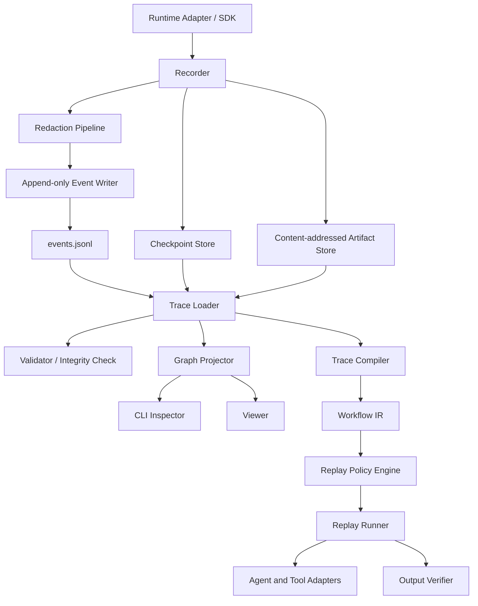

# Agent Loop Snapshot 实施规划

本文将产品设想拆分为可以独立实现和验收的工程任务。任务编号采用 `ALS-<阶段><序号>`；后续 Issue、分支和提交信息应复用这些编号。

## 1. 交付范围

### 1.1 MVP 范围

MVP 要完成“记录 → 验证 → 可视化 → 安全回放”的最小闭环：

- 为一个示例 Agent Runtime 提供 Recorder SDK。
- 写入版本化的 manifest、JSONL 事件、checkpoint 和 artifact。
- 验证快照完整性，并从事件重建运行状态。
- 将 Trace 投影为 DAG 和 Mermaid 文本。
- 支持 Mock Replay。
- 对敏感字段进行脱敏，对副作用进行拦截。

### 1.2 MVP 之后

- Verified Replay 和差异报告。
- 从 checkpoint 恢复运行。
- Workflow IR、Trace Compiler 和 Semantic Replay。
- Web Viewer、跨框架 Adapter、schema 迁移和正式发布。

### 1.3 非目标

- 保证模型输出逐 token 一致。
- 保存或复现模型隐藏思维链。
- 绕过 Agent Runtime 原有的权限与审批机制。
- 在 MVP 阶段兼容所有 Agent 框架。
- 将一次有噪声的历史 Trace 不经审核直接作为生产工作流。

## 2. 关键设计决策

以下表格是当前实现基线。TypeScript 技术路线已经确认；其余决策在对应任务中固化。若发生变更，应添加 ADR，而不是仅修改实现。

| 主题          | 当前选择                          | 理由                                                          |
| ------------- | --------------------------------- | ------------------------------------------------------------- |
| 首个 SDK      | TypeScript / Node.js 当前活跃 LTS | 适合 Agent 工具链、CLI 和 Viewer 共用类型；已由 ADR-0001 确认 |
| 事件存储      | `events.jsonl`                    | 追加写、流式读取、崩溃后保留已刷盘事件                        |
| Schema        | JSON Schema 2020-12               | 语言无关，可生成校验器和类型                                  |
| Workflow 文件 | YAML，按同一 JSON Schema 校验     | 便于人工审阅和修改                                            |
| Artifact      | SHA-256 内容寻址                  | 去重、完整性校验、引用稳定                                    |
| 时间          | UTC RFC 3339 + 单调时钟耗时       | 兼顾跨环境比较和准确耗时                                      |
| 状态恢复      | 周期性全量 checkpoint + 事件增量  | 优先保证实现和调试简单                                        |
| 图模型        | 有向无环图；事件允许多个父节点    | 表达分支、并行与汇合                                          |

## 3. 目标架构与数据流



### 3.1 事件包络最小字段

所有事件共享以下字段，事件专属数据放入 `payload`：

```json
{
  "schema_version": "0.1.0",
  "run_id": "run_01K...",
  "event_id": "evt_01K...",
  "parent_ids": ["evt_01J..."],
  "sequence": 18,
  "type": "tool.completed",
  "timestamp": "2026-09-06T02:21:33.418Z",
  "monotonic_offset_ms": 1422,
  "actor": "agent.main",
  "payload": {},
  "security": {
    "side_effect": "read_only",
    "redactions": []
  }
}
```

MVP 事件类型：

- `run.started`、`run.completed`、`run.failed`
- `model.requested`、`model.completed`、`model.failed`
- `tool.requested`、`tool.completed`、`tool.failed`
- `decision.recorded`
- `state.changed`
- `checkpoint.created`
- `verification.completed`

`decision.recorded` 只保存可审计的决定、依据摘要和成功条件，不保存隐藏思维链。

## 4. 里程碑总览

| 里程碑              | 结果                                   | 入口条件     | 完成条件                                       |
| ------------------- | -------------------------------------- | ------------ | ---------------------------------------------- |
| M0 基础与协议       | 仓库、ADR、schema 和固定夹具可用       | 技术路线确认 | CI 能校验合法与非法快照                        |
| M1 快照记录         | 已完成：Example Runtime 能生成完整快照 | M0 完成      | 崩溃恢复、artifact、脱敏和固定示例快照测试通过 |
| M2 检查与图投影     | CLI 可查看并生成 DAG                   | M1 完成      | 固定夹具图输出稳定、并行因果关系正确           |
| M3 安全回放         | Mock Replay 闭环可用                   | M2 完成      | 最终状态一致且副作用默认被阻止                 |
| M4 工作流与语义回放 | 另一个 Agent 可按 Workflow IR 执行     | M3 完成      | 跨运行输入可参数化并通过验证器                 |
| M5 工程化发布       | 可迁移、可观测、可发布                 | M4 完成      | 文档、兼容矩阵、发布流程齐全                   |

## 5. 任务依赖图

```mermaid
flowchart LR
    A001[ALS-001 技术决策] --> A002[ALS-002 仓库骨架]
    A001 --> A003[ALS-003 Snapshot Schema]
    A003 --> A004[ALS-004 固定夹具与校验]
    A002 --> A101[ALS-101 Recorder API]
    A004 --> A101
    A101 --> A102[ALS-102 JSONL Writer]
    A101 --> A103[ALS-103 Artifact Store]
    A101 --> A104[ALS-104 Checkpoint]
    A101 --> A105[ALS-105 Redaction]
    A102 --> A106[ALS-106 Runtime Adapter]
    A103 --> A106
    A104 --> A106
    A105 --> A106
    A106 --> A201[ALS-201 Trace Loader]
    A201 --> A202[ALS-202 Graph Projector]
    A202 --> A203[ALS-203 Inspect / Graph CLI]
    A201 --> A301[ALS-301 Replay Adapter]
    A301 --> A302[ALS-302 Policy Engine]
    A302 --> A303[ALS-303 Mock Replay]
    A303 --> A304[ALS-304 Resume / Verified Replay]
    A304 --> A401[ALS-401 Workflow IR]
    A401 --> A402[ALS-402 Trace Compiler]
    A402 --> A403[ALS-403 Semantic Replay]
    A403 --> A501[ALS-501 稳定化与发布]
```



## 6. 详细任务清单

### M0：基础与协议

#### ALS-001：固化技术路线并建立基础 ADR

**工作内容**

- 使用已经确认的 TypeScript 技术路线初始化首个 SDK；Node.js 精确版本在仓库初始化时锁定为当时的活跃 LTS。
- 确认首个目标 Agent Runtime。
- 为事件顺序、ID、时钟、错误模型和版本策略建立 ADR。
- 明确开源许可证。

**交付物**

- `docs/adr/0001-use-typescript.md`（已完成）
- `docs/adr/0002-runtime-and-storage.md`
- `docs/adr/0003-event-ordering-and-identity.md`
- `LICENSE`

**验收标准**

- ADR 明确记录被采用方案、备选方案和后果。
- 核心包、首个 SDK、CLI 和 Viewer 使用 TypeScript，不再将语言选择作为实现阶段的开放问题。
- 不同进程产生的事件 ID 不冲突。
- 明确 `sequence` 仅表示单次 Run 内的稳定写入顺序，因果关系由 `parent_ids` 表达。

#### ALS-002：初始化仓库骨架和质量门禁

**依赖**：ALS-001

**工作内容**

- 初始化 workspace、构建、lint、格式化和测试配置。
- 创建 `schema`、`recorder`、`trace`、`graph`、`replay`、`cli` 包。
- 配置变更检查和 CI。

**验收标准**

- 全新检出后，一条命令可安装并运行全部检查。
- CI 覆盖构建、类型检查、单元测试和 schema fixture 测试。
- 包之间没有循环依赖。

#### ALS-003：定义 Snapshot Schema v0.1

**依赖**：ALS-001

**工作内容**

- 定义 manifest、事件包络、事件 payload、checkpoint 和 artifact reference schema。
- 定义运行状态和结束状态。
- 所有持久化对象包含 `schema_version`。
- 定义未知字段和未知事件类型的兼容行为。

**验收标准**

- schema 能表达串行、并行、失败、重试和汇合。
- payload 超过阈值时可以替换为 artifact reference。
- 解析器能够报告具体 JSON path 和错误原因。

#### ALS-004：建立固定夹具和 Schema 校验器

**依赖**：ALS-003

**工作内容**

- 创建最小成功、工具失败重试、并行调用、损坏引用和未知版本夹具。
- 生成或维护 TypeScript 类型。
- 实现 `validateSnapshot()`。

**验收标准**

- 合法夹具全部通过，非法夹具因预期原因失败。
- schema 和生成类型不发生静默漂移。
- 夹具可供后续图投影和回放测试复用。

### M1：快照记录

#### ALS-101：实现 Recorder 生命周期 API

**依赖**：ALS-002、ALS-004

**工作内容**

- 实现 `startRun`、`appendEvent`、`checkpoint`、`completeRun`、`failRun`。
- 支持父事件上下文传播和并行分支。
- 为事件写入提供 hook/interceptor 接口。

**验收标准**

- 生命周期状态机拒绝非法转换，例如完成后继续追加事件。
- 并发调用生成唯一 ID，并保留正确的父子关系。
- Recorder API 不绑定具体模型供应商。

#### ALS-102：实现耐崩溃 JSONL Writer

**依赖**：ALS-101

**工作内容**

- 逐事件追加并配置刷盘策略。
- 使用临时 manifest 和原子重命名完成最终提交。
- 启动时检测未完整结束的 Run。

**验收标准**

- 在任意完整行后中断进程，已写事件仍可读取。
- 尾部半行被标记为损坏而不是导致整份 Trace 不可用。
- 单 Run 内的 `sequence` 不重复且单调增加。

#### ALS-103：实现内容寻址 Artifact Store

**依赖**：ALS-101

**工作内容**

- 以 SHA-256 保存二进制或大型文本。
- 在事件中保存 digest、媒体类型、字节数和可选预览。
- 支持去重、完整性检查和缺失引用报告。

**验收标准**

- 相同内容只保存一次。
- 篡改后的 artifact 在校验时可被发现。
- Loader 不会因未知媒体类型崩溃。

#### ALS-104：实现 Checkpoint Store 和状态重建

**依赖**：ALS-101

**工作内容**

- 定义可恢复状态与仅供观察状态的边界。
- 保存周期性全量 checkpoint。
- 从最近 checkpoint 加后续事件重建状态。

**验收标准**

- 从头重建与从 checkpoint 重建得到相同状态哈希。
- checkpoint 明确记录对应的最后事件和 sequence。
- 缺少或损坏 checkpoint 时可以降级为从事件流重建。

#### ALS-105：实现脱敏流水线

**依赖**：ALS-101

**工作内容**

- 支持字段路径规则、正则规则和自定义 redactor。
- Secret 使用引用占位符，不保存原值。
- 在事件中记录发生了哪些类别的脱敏，不记录敏感值。

**验收标准**

- API key、授权头和已配置字段不会出现在事件、日志或错误信息中。
- 脱敏发生在持久化之前。
- 测试包含嵌套对象、数组、artifact 和异常堆栈。

#### ALS-106：接入第一个 Runtime 并提供示例 Agent

**依赖**：ALS-102、ALS-103、ALS-104、ALS-105

**工作内容**

- 对模型调用、工具调用和状态更新增加 adapter。
- 实现一个包含工具失败重试与并行只读调用的示例。
- 生成一份可提交的脱敏示例快照。

**验收标准**

- 示例运行无需手工拼接事件。
- 快照通过 ALS-004 校验器。
- 事件能区分 request、result、failure 和 retry。

**M1 收尾记录（2026-09-06）**

- 已提交固定的脱敏示例快照：`packages/example-runtime/fixtures/example-run/`；
- 示例快照覆盖模型调用、并行只读工具、工具失败重试、状态变更和 checkpoint，并通过 ALS-004 校验器；
- Node.js 24.20.0、pnpm 11.19.0 下的 M1 完整质量门禁通过，历史记录为 32 passed、0 failed；
- M1 已完成；M2 的 ALS-201 Trace Loader、ALS-202 Graph Projector 和 ALS-203 CLI 也已完成，后续进入 ALS-301 Replay Adapter。

### M2：检查与图投影

#### ALS-201：实现 Trace Loader 和查询模型（已完成）

**依赖**：ALS-106

**工作内容**

- 流式读取 JSONL，加载 manifest、checkpoint 和 artifact metadata。
- 构建 event-by-id、children、actor、type 和时间索引。
- 检测孤儿事件、环、重复 ID 和断裂引用。

**验收标准**

- 大 Trace 无需一次性加载所有 artifact 内容。
- 损坏项以诊断列表返回，包含严重级别和位置。
- 100k 事件性能基线被记录，后续可以回归比较。

**完成记录（2026-09-06）**

- 已实现流式 JSONL loader、manifest/checkpoint/artifact metadata 加载和查询索引；
- 已覆盖事件 ID、children、actor、type、sequence 和时间范围查询；
- 已加入 schema、JSONL 尾部、因果环、断裂父引用、缺失 artifact 和字节数不匹配诊断；
- 已使用现有 golden fixtures 和临时损坏快照测试，完整质量门禁通过；
- 已增加 100k 事件基准，当前本机中位加载耗时为 2446.90 ms，约 40868 events/s，记录见 `docs/benchmarks/trace-loader-100k.md`。

#### ALS-202：实现 Graph Projector（已完成）

**依赖**：ALS-201

**工作内容**

- 生成因果 DAG、调用树和线性时间线投影。
- 支持按 actor、事件类型和状态过滤。
- 折叠连续模型流式事件和低层噪声事件。

**验收标准**

- 并行分支与汇合不会被错误显示为串行。
- 每个图节点可追溯到原始 event ID。
- 固定夹具的图快照测试稳定通过。

**完成记录（2026-09-06）**

- 已实现因果 DAG、调用树和线性时间线投影；
- 已支持 actor、事件类型、状态和 sequence 范围过滤；
- 已折叠连续模型流式事件和低层噪声，并保留源 event ID；
- 已验证并行分支、多父节点汇合，并新增 `packages/graph/golden/parallel-calls.causal-dag.json` 稳定输出回归，完整质量门禁通过。

#### ALS-203：实现 `validate`、`inspect` 和 `graph` CLI（已完成）

**依赖**：ALS-202

**工作内容**

- 输出运行摘要、错误、耗时、调用计数和最终状态。
- 将 DAG 导出为 Mermaid。
- 提供稳定的机器可读 JSON 输出模式。

**验收标准**

- 命令退出码区分成功、校验失败和运行错误。
- Mermaid 输出可被标准渲染器解析。
- 默认终端输出不泄漏被脱敏数据。

**完成记录（2026-09-06）**

- 已实现 `validate`、`inspect` 和 `graph` 命令，并接入 Trace Loader 和 Graph Projector；
- 已提供 `0` 成功、`2` 校验失败、`1` 参数/运行错误的稳定退出码；
- 已提供 JSON 机器输出、Mermaid DAG、调用树和时间线导出，以及 graph 过滤参数；
- `inspect` 默认只输出摘要、错误代码和诊断，不输出事件 payload；
- 已增加确定性的 Mermaid flowchart 输出回归，并通过 JSON/文本/退出码测试；
- 本机 Node.js 24.20.0、pnpm 11.19.0 下完整质量门禁通过，测试结果为 60 passed、0 failed。

**M2 收尾记录（2026-09-06）**

- 已完成 Trace Loader 的 100k 事件性能基线，三次运行中位加载耗时为 2446.90 ms，基线详情见 `docs/benchmarks/trace-loader-100k.md`；
- 已提交并行分支/汇合 DAG 和 Mermaid flowchart 的 golden 输出，防止投影与导出格式漂移；
- 已提供 `pnpm run alsnap -- ...` workspace CLI 入口；
- 本机 Node.js 24.20.0、pnpm 11.19.0 下最终质量门禁为 60 passed、0 failed，M2 核心任务 ALS-201 至 ALS-203 收尾完成；ALS-204 Viewer 按计划延期。

#### ALS-204：构建只读 Viewer

**依赖**：ALS-202；可推迟到 MVP 后

**工作内容**

- 展示时间线、DAG、节点详情和状态差异。
- 支持按照 actor、类型、状态过滤。
- 大型 payload 按需读取。

**验收标准**

- 节点详情包含输入摘要、输出摘要、耗时、状态和 artifact 链接。
- 100k 事件 Trace 不会一次渲染全部节点。
- Viewer 不执行快照中的任何脚本或主动网络请求。

### M3：安全回放

#### ALS-301：定义 Agent 与 Tool Replay Adapter（已完成）

**依赖**：ALS-201

**工作内容**

- 定义模型、工具、时钟、随机数和环境读取接口。
- 为每次调用定义稳定 correlation key。
- 支持真实实现和记录结果实现之间切换。

**验收标准**

- Replay Runner 不直接依赖具体供应商 SDK。
- 缺少 adapter 时返回可诊断错误。
- adapter 可以声明版本、能力和副作用级别。

**完成记录（2026-09-07）**

- `@agent-loop-snapshot/replay` 已定义模型、工具、时钟、随机数和环境读取的供应商无关 adapter 协议；
- `createReplayCorrelationKey()` 依据稳定的调用种类、目标和逻辑序号生成 correlation key，重试通过单独的 `attempt` 表示；
- `ReplayAdapterRegistry` 可在 `live` 与 `recorded` 实现之间切换，并对缺失 adapter、重复工具 adapter 和缺少声明能力返回结构化诊断；
- `createRecordedReplayAdapterSet()` 可从 Trace 构造只读 recorded-result adapter，按 correlation key 和 attempt 返回历史成功或失败结果，不执行历史副作用；
- 已使用固定 Example Runtime snapshot 覆盖 recorded adapter 的模型结果、工具重试和缺失记录路径。

#### ALS-302：实现副作用 Policy Engine（已完成）

**依赖**：ALS-301

**工作内容**

- 将操作分为 `read_only`、`workspace_write`、`external_write`、`destructive`。
- 支持 allow、deny、dry-run 和 require-approval 决策。
- 将策略决定写入新的 Replay Trace。

**验收标准**

- 默认只允许 Mock 结果和只读操作。
- 历史授权不会被继承为新授权。
- 拒绝操作不会调用底层工具。

**完成记录（2026-09-07）**

- `ReplayPolicyEngine` 根据 adapter mode、类型、目标与副作用级别匹配首条策略规则，支持 allow、deny、dry-run 与 require-approval；
- 安全默认策略仅允许 recorded result，以及 live 的 `read_only` 调用；live 写入与 destructive 调用默认拒绝；
- `require_approval` 仅接受与当前 action ID 匹配的新审批对象，Policy Engine 不读取或继承源 Trace 的授权信息；
- `execute()` 在 allow 前先交给审计 sink，deny、dry-run 和 require-approval 均不会调用底层 operation；
- `RecorderReplayPolicyAuditSink` 将决策及 action 元数据作为 `decision.recorded` 事件写入新建 Replay Trace，且新增测试覆盖默认拒绝、当前审批、dry-run 与审计顺序。

#### ALS-303：实现 Mock Replay（已完成）

**依赖**：ALS-302

**工作内容**

- 按 correlation key 返回已记录的模型和工具结果。
- 支持失败、超时和重试结果。
- 输出一份新的 Replay Trace，并关联源 Run。

**验收标准**

- 固定夹具回放后的最终状态哈希一致。
- Mock Replay 不产生文件、网络或外部系统副作用。
- 调用顺序或参数不匹配时给出结构化差异。

**完成记录（2026-09-07）**

- `MockReplayRunner` 仅构造并解析 recorded-result adapter，绝不解析或调用 live adapter；每次 recorded 调用均通过 `ReplayPolicyEngine.execute()`；
- Runner 会在新 Run 的输入和最终输出中关联 source run ID，复制可恢复的 `state.changed` 事件，并在成功时写入 checkpoint 与 terminal manifest；
- 固定 Example Runtime snapshot 的模型调用、并行只读工具、失败重试均被记录到新 Replay Trace，最终状态哈希与源 Run 一致；
- 提供可选 call plan；调用数量、种类、目标、correlation key、attempt 或输入不一致时，Runner 在调用 recorded adapter 前返回结构化差异并终止；
- recorded adapter 与 Policy Engine 均不执行文件、网络或外部系统操作，新的 policy audit 事件保留在 Replay Trace 中。

#### ALS-304：实现 Checkpoint Resume 和 Verified Replay（已完成）

**依赖**：ALS-303

**工作内容**

- 从选定 checkpoint 恢复。
- 重新调用被允许的 adapter。
- 对结构化输出、文本、文件哈希和自定义断言生成差异报告。

**验收标准**

- 用户能明确选择起始 checkpoint。
- 时间戳、随机 ID 等易变字段可通过声明式规则忽略。
- 所有真实副作用都经过 ALS-302。

**完成记录（2026-09-07）**

- `selectReplayResumePoint()` 允许调用者通过 checkpoint ID 选择源快照的恢复点，验证 source event 绑定与 state hash，并将 checkpoint state 作为新 Replay Run 的初始 checkpoint；
- `VerifiedReplayRunner` 使用显式的 live adapter registry 执行恢复点后的模型/工具调用；每次调用都由 `ReplayPolicyEngine.execute()` 守卫并写入新的 policy audit 事件；
- 输出验证支持 JSON Pointer（单段 `*` 通配符）忽略规则、可选空白规范化的文本比较、声明文件 SHA-256 比较和同步/异步自定义断言；
- 结构化差异区分结果状态、类型、值、文本、文件哈希与断言失败；验证差异不会掩盖为成功输出；
- 固定 Example Runtime snapshot 覆盖完全匹配的 live replay、checkpoint resume、易变字段忽略、文本/哈希规则及不匹配输出/自定义断言。

### M4：Workflow IR 与 Semantic Replay

#### ALS-401：定义 Workflow IR v0.1

**依赖**：ALS-304

**工作内容**

- 定义 input、node、dependency、condition、retry、output schema 和 verifier。
- 定义权限需求和副作用元数据。
- 支持 agent task、tool call、verification、human approval 四类节点。

**验收标准**

- IR 能表达顺序、分支、并行、汇合、重试和失败终止。
- 所有节点都能声明成功条件。
- YAML 和 JSON 表达通过同一 schema 校验。

**完成记录（2026-09-07）**

- `@agent-loop-snapshot/schema` 新增 `workflow.schema.json`、Workflow IR TypeScript 类型与 `validateWorkflow()`；
- IR 包含 input、四类节点、依赖结果、条件、重试、失败行为、输出、verifier 和权限/副作用元数据；
- schema 要求每个节点至少定义一个 success condition，语义校验会检查节点、输出、输入/节点输出引用、verifier 引用和依赖环；
- JSON 和 YAML 都在解析为对象后进入同一 schema 与语义校验器；固定测试覆盖分支、并行、汇合、重试和失败继续路径。

#### ALS-402：实现 Trace Compiler

**依赖**：ALS-401

**工作内容**

- 将原始事件归并为候选工作流节点。
- 识别失败尝试、环境常量和候选参数。
- 输出来源映射，使每个 IR 节点可追溯到事件集合。
- 第一版允许人工确认和编辑，不追求全自动泛化。

**验收标准**

- 编译结果不会自动携带 Secret 或历史审批。
- 被删除的失败步骤仍保留在编译报告中。
- 编译相同固定 Trace 产生规范化后一致的 IR。

**完成记录（2026-09-07）**

- `@agent-loop-snapshot/replay` 新增 `compileTraceToWorkflow()`，从有效 `TraceSnapshot` 生成可编辑 Workflow IR、节点到事件的来源映射和编译报告；
- 模型/工具调用按 correlation key 归并，父事件关系转为依赖边，重试失败保留在 `removedFailureSteps` 中而不重复成为工作流节点；
- 报告包含输入 schema 候选与模型/工具环境常量，历史输入值、工具参数、模型输入输出、决策文本和审批均不会进入 IR 或报告；
- 固定 Example Runtime Trace 验证了稳定输出、并行依赖、重试失败映射与敏感运行数据不泄漏。

#### ALS-403：实现 Semantic Replay Runner

**依赖**：ALS-402

**工作内容**

- 将节点目标、输入、约束和输出 schema 交给执行 Agent。
- 允许实际工具调用序列与原 Trace 不同。
- 使用 verifier 判断节点和工作流是否完成。

**验收标准**

- 以新输入运行时不依赖原 Run 的绝对路径和临时 ID。
- Agent 未满足输出 schema 时触发受限重试或失败。
- 最终报告区分“过程相同”和“结果等价”。

**完成记录（2026-09-07）**

- `SemanticReplayRunner` 接受 Workflow IR、新输入和显式 Semantic Agent adapter；adapter 可采用与原 Trace 不同的内部工具序列；
- 节点依赖、条件、失败策略与有界重试由 Runner 调度，output schema、条件和 JSON Schema/custom/human verifier 共同决定节点是否成功；
- 每次 Agent 与自定义 verifier 调用均通过 Policy Engine 审计，使用节点与 adapter 中更严格的副作用级别；
- 最终报告独立给出过程匹配与结果等价状态，并覆盖新输入、schema 失败重试和外部写入执行前拦截测试。

#### ALS-404：实现跨 Runtime Adapter 和兼容性套件

**依赖**：ALS-403

**工作内容**

- 接入第二种 Agent Runtime 或第二种语言 SDK。
- 建立相同 Workflow IR 的兼容性测试。
- 记录能力差异和降级行为。

**验收标准**

- 至少一个 Workflow 能由两个不同 adapter 执行。
- 不支持的能力在运行前被检测，而不是执行到一半才失败。

**完成记录（2026-09-07）**

- Semantic Agent adapter 可声明四类 `semantic.node.*` 节点能力，`inspectSemanticAgentCompatibility()` 在执行前计算 required/unsupported 能力与兼容模式；
- 新增无外部依赖的 `ScriptedSemanticRuntimeAdapter` 作为第二个确定性 Agent runtime，实现公开的 `SemanticAgentAdapter` 协议；
- 同一固定 Workflow IR 已由参考 adapter 与 Scripted Runtime 执行并验证等价输出；
- 受限 runtime 缺少 verification 能力时会在首次 Agent 调用前失败，并输出结构化 `AGENT_CAPABILITY_MISSING` 诊断。

### M5：稳定化与发布

#### ALS-501：Schema 迁移和兼容策略

**工作内容**

- 实现旧版本读取、显式迁移和迁移报告。
- 建立 golden fixtures，禁止破坏性 schema 漂移。
- 定义 major/minor/patch 兼容语义。

**验收标准**

- 迁移不会原地覆盖源快照。
- 每个迁移步骤可重复执行并验证输出。
- 未知 major 版本默认拒绝执行，但允许安全地查看元数据。

**完成记录（2026-09-07）**

- `@agent-loop-snapshot/schema` 新增 semver 兼容性检查、安全 metadata view、纯文档迁移和目录迁移 API；
- 定义精确版本可执行、`0.0.0 → 0.1.0` 注册迁移、同 major 未注册版本 view-only、未知 major 永不执行/迁移的策略；
- 目录迁移要求新输出目录，使用同盘临时目录验证后原子重命名，源快照和 artifact 不会被覆盖；
- 新增 `legacy-v0.0.0` golden fixture，覆盖迁移合法性、幂等、源文件不变、输出存在保护和未知 major metadata view。

#### ALS-502：性能、并发和故障注入

**工作内容**

- 测量记录延迟、吞吐、磁盘占用和图构建耗时。
- 注入进程终止、磁盘写入失败、损坏 artifact 和乱序完成。
- 为并发 Recorder 建立压力测试。

**验收标准**

- 性能基准和目标阈值记录在仓库中。
- 故障不会产生看似成功但不可验证的快照。
- 所有部分成功状态都有明确诊断。

**完成记录（2026-09-07）**

- 新增 Recorder 10k、Trace Loader 100k 和 Graph Projector 100k 基准脚本，以及 `benchmark:als-502` 聚合入口；首次本机结果、同机回归阈值和运行方式记录在 `docs/benchmarks/als-502.md`。
- Recorder 的耐久性边界移动到事件发布前：JSONL 写入失败时，内存事件、sequence、manifest event count 和终态均不会推进；落盘快照保持 `UNFINISHED_RUN` 诊断，而不会表现为可验证成功。
- `JsonlWriterFaultInjector` 和 `ArtifactStoreFaultInjector` 覆盖模拟磁盘写入失败；Artifact 写入失败会清理临时文件并返回 `ARTIFACT_WRITE_FAILED`，篡改、尾部截断和未完成 manifest 均持续返回结构化诊断。
- 新增 500 路并发 Recorder 压力与延迟到达测试，验证唯一事件 ID、无间隙 sequence、共享父事件和实际到达顺序。

#### ALS-503：安全审查与发布准备

**工作内容**

- 对路径穿越、恶意快照、压缩炸弹、脚本注入和 Secret 泄漏进行审查。
- 补全用户指南、协议说明、示例和升级指南。
- 配置版本、变更日志和包发布流程。

**验收标准**

- Viewer 和 CLI 将快照内容视为不可信输入。
- 解包和 artifact 读取限制在目标目录内，并配置大小限制。
- 发布包可在干净环境完成安装、示例记录、图导出和 Mock Replay。

**完成记录（2026-09-07）**

- `Trace Loader` 与 `validateSnapshotDirectory()` 现在默认限制 `events.jsonl` 和单一 artifact 为 64 MiB，并允许调用方以 `maxEventFileBytes`、`maxArtifactBytes` 收紧限制；超限输入产生结构化诊断，不继续读取。
- 事件与 artifact 仅接受快照目录内的常规文件；符号链接、目录或特殊条目被标记为不可信。系统不解压 archive，也不会执行来自快照或 artifact 的脚本。
- 新增安全与发布指南、变更日志、tarball `files` 白名单，以及 `pack:check` / `release:verify`。发布 smoke 会在临时消费者目录中从本地 tarball 安装所有内部包，再验证、导图并 Mock Replay 脱敏示例快照。
- 所有包在当前仍为 `private`，需要在已确定 registry、npm scope 与发布负责人后另行审查并解除该保护。

## 7. 建议迭代顺序

在两周迭代节奏下，可以按以下方式组织；实际周期以团队规模和首个 Runtime 的复杂度调整。

### 迭代 1：协议可验证

- ALS-001、ALS-002、ALS-003、ALS-004
- 迭代演示：验证一组手写快照并输出结构化错误。

### 迭代 2：生成真实快照

- ALS-101 至 ALS-106
- 迭代演示：运行示例 Agent，得到可恢复、已脱敏的快照目录。

### 迭代 3：看见 Loop

- ALS-201、ALS-202、ALS-203
- 迭代演示：从真实快照输出摘要和 Mermaid DAG。

### 迭代 4：安全回放闭环

- ALS-301、ALS-302、ALS-303
- 迭代演示：Mock Replay 最终状态一致，副作用调用为零。

### 后续迭代

- ALS-304、M4、M5 和可选 Viewer。

## 8. 测试策略

| 层次        | 测试重点                                              |
| ----------- | ----------------------------------------------------- |
| Schema      | 合法/非法事件、未知版本、缺失字段、引用完整性         |
| Recorder    | 并发 ID、顺序、刷盘、中断恢复、生命周期状态机         |
| Security    | 嵌套脱敏、错误信息泄漏、路径穿越、副作用拦截          |
| Graph       | 并行、汇合、重试、孤儿、环检测、稳定投影              |
| Replay      | correlation 匹配、状态一致、失败重试、策略拒绝        |
| Workflow    | 参数化、输出 schema、分支条件、跨 adapter 兼容        |
| Performance | 100k 事件读取、索引内存、artifact 延迟、Viewer 虚拟化 |

每个里程碑至少保留一份脱敏后的端到端 golden snapshot，作为后续兼容性测试输入。

## 9. Definition of Done

单个任务只有同时满足以下条件才算完成：

- 实现已通过类型检查、lint 和自动化测试。
- 新增持久化字段同时更新 schema、类型和 fixture。
- 对失败路径和敏感数据路径有测试。
- 用户可见行为已更新 README 或对应文档。
- 新增 CLI 行为具有稳定退出码和机器可读错误。
- 涉及副作用的功能经过 Policy Engine，不直接调用底层工具。
- 没有把模型隐藏思维链作为协议依赖。

## 10. 首批可直接创建的 Issue

建议首先创建并按以下顺序领取：

1. `ALS-001 Confirm initial runtime and complete foundational ADRs`
2. `ALS-002 Initialize TypeScript workspace and CI`
3. `ALS-003 Define Snapshot Schema v0.1`
4. `ALS-004 Add schema validator and golden fixtures`
5. `ALS-101 Implement Recorder lifecycle API`
6. `ALS-102 Implement crash-tolerant JSONL writer`
7. `ALS-103 Implement content-addressed artifact store`
8. `ALS-104 Implement checkpoints and state reconstruction`
9. `ALS-105 Implement pre-persistence redaction pipeline`
10. `ALS-106 Instrument the first example Agent Runtime`

第一阶段不应并行修改事件协议和大量 Runtime 集成。先让 schema、fixture 和兼容规则稳定，再扩大 adapter 范围。
